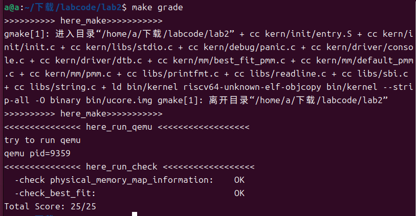

# Lab2

# 练习一 理解 first-fit 连续物理内存分配算法

first-fit 连续物理内存分配算法作为物理内存分配一个很基础的方法，需要同学们理解它的实现过程。请大家仔细阅读实验手册的教程并结合kern/mm/default_pmm.c中的相关代码，认真分析default_init，default_init_memmap，default_alloc_pages， default_free_pages等相关函数，并描述程序在进行物理内存分配的过程以及各个函数的作用。 请在实验报告中简要说明你的设计实现过程。请回答如下问题：

你的first fit算法是否有进一步的改进空间？

first fit算法的主要策略是从空闲链表中找到第一个足够大的空闲块，然后分配请求的内存。default_pmm.c中的代码实现了使用first fit算法的物理内存分配管理器，具体由下面四个函数组成：

**default_init**: 初始化空闲链表free_list并初始化空闲页数nr_free为0。

主要作用是为后续的内存分配操作做准备。它创建一个空的链表，该链表将在后续的内存分配过程中存储空闲页面的地址。

**default_init_memmap**: 初始化一个连续的内存块，并将其插入空闲链表。

具体是将每个页面的标志位flags和属性property都清除，引用计数设置为 0，设置空闲块base的属性，并将其按照地址顺序插入到空闲链表。

**default_alloc_pages**: 使用first fit算法分配空闲内存页。

具体是遍历空闲链表，通过p->property >= n找到第一个足够大的空闲块，如果该空闲块的大小大于请求的内存页面数，则分割该块，后边的剩余部分重新加入空闲链表，然后更新nr_free。

**default_free_pages**: 释放内存页，并尝试与相邻的空闲块合并。

具体是先遍历base 到base+n范围内的页面，恢复到空闲状态，并设置第一个base页的property为n，更新nr_free。再将释放的内存块按照地址顺序插入空闲链表，并判断当前的空闲块是否和前面或后面的空闲块相邻，如果相邻就合并。

**改进空间**：

1.first fit算法可能会导致内存碎片化，因为它始终选择第一个满足要求的空闲块，而不考虑剩余空间的大小，会导致链表中出现很多小的碎片。如果使用best fit算法就可以避免这个问题，不会浪费过多的内存空间。

2.first fit算法需要遍历整个空闲链表，查找合适的内存块随着内存的增长，这个遍历过程可能变得低效，可以考虑使用更高效的数据结构（例如平衡二叉树或堆），以更快地找到合适的空闲块。

3.当前first fit算法中合并空闲块的时机是在释放内存时，为了进一步优化内存利用，可以在分配内存时进行合并操作，避免空闲块的浪费。

# 练习2 实现 Best-Fit 连续物理内存分配算法

在完成练习一后，参考kern/mm/default_pmm.c对First Fit算法的实现，编程实现Best Fit页面分配算法，算法的时空复杂度不做要求，能通过测试即可。 请在实验报告中简要说明你的设计实现过程，阐述代码是如何对物理内存进行分配和释放，并回答如下问题：

你的 Best-Fit 算法是否有进一步的改进空间？

**best_fit_init_memmap**:

主要是初始化空闲块并按物理地址递增的顺序插入free_list，这部分和first fit是完全一样的。
```
static void
best_fit_init_memmap(struct Page *base, size_t n) {
    assert(n > 0);
    struct Page *p = base;
    for (; p != base + n; p ++) {
        assert(PageReserved(p));
        /*LAB2 EXERCISE 2: 2213523*/ 
        // 清空当前页框的标志和属性信息，并将页框的引用计数设置为0
        // 这里和first fit完全一样，就是把这里信息清空
        p->flags = 0;  // 清空标志
        p->property = 0;  // 清空属性
        set_page_ref(p, 0);  // 设置引用计数为0
    }
    // base是空闲块头
    base->property = n;
    SetPageProperty(base);
    nr_free += n;
    // 若free_list为空，直接插入
    if (list_empty(&free_list)) {
        list_add(&free_list, &(base->page_link));
    } else {
        list_entry_t* le = &free_list;
        while ((le = list_next(le)) != &free_list) {
            struct Page* page = le2page(le, page_link);
            /*LAB2 EXERCISE 2: 2213523*/ 
            // 编写代码
            // 1、当base < page时，找到第一个大于base的页，将base插入到它前面，并退出循环
            // 2、当list_next(le) == &free_list时，若已经到达链表结尾，将base插入到链表尾部
            // 2) 有序插入 free_list（保持从低地址到高地址）
            // 这里和first fit也是完全一样，就是从头往后遍历空闲链表，按照物理地址有序插入，best fit和first fit的主要区别在后面
            if (base < page) {
            list_add_before(le, &(base->page_link));
            break;
            } else if (list_next(le) == &free_list) {
            list_add(le, &(base->page_link));
            }
        }
    }
}
```

**best_fit_alloc_pages**:
主要思路是，我们顺序查找，通过预先定义的min_size记录最小连续空闲页框数量，如果有页面的property大于等于n并且property小于min_size，我们就用变量page记录改页面，并修改min_size为当前页面的property，如此往复直到循环结束。
此时，我们得到了满足需求的页面page，并且min_size是当前最小连续空闲页框数量。
```c
best_fit_alloc_pages(size_t n) {
    assert(n > 0);
    if (n > nr_free) {
        return NULL;
    }
    struct Page *page = NULL;
    list_entry_t *le = &free_list;
    size_t min_size = nr_free + 1;
    
    /*LAB2 EXERCISE 2: 2311008*/ 
    // 下面的代码是first-fit的部分代码，请修改下面的代码改为best-fit
    // 遍历空闲链表，查找满足需求的空闲页框
    // 如果找到满足需求的页面，记录该页面以及当前找到的最小连续空闲页框数量
    while ((le = list_next(le)) != &free_list) {
        struct Page *p = le2page(le, page_link);
        if (p->property >= n && p->property < min_size) {
            page = p;
            min_size = p->property;
        }
    }

    if (page != NULL) {
        list_entry_t* prev = list_prev(&(page->page_link));
        list_del(&(page->page_link));
        if (page->property > n) {
            struct Page *p = page + n;
            p->property = page->property - n;
            SetPageProperty(p);
            list_add(prev, &(p->page_link));
        }
        nr_free -= n;
        ClearPageProperty(page);
    }
    return page;
}
```

**best_fit_free_pages**:

```
static void
best_fit_free_pages(struct Page *base, size_t n) {
    assert(n > 0);
    struct Page *p = base;
    for (; p != base + n; p ++) {
        assert(!PageReserved(p) && !PageProperty(p));
        p->flags = 0;
        set_page_ref(p, 0);
    }
    /*LAB2 EXERCISE 2: 2310413*/ 
    // 编写代码
    // 具体来说就是设置当前页块的属性为释放的页块数、并将当前页块标记为已分配状态、最后增加nr_free的值
    base->property = n;
    SetPageProperty(base);
    nr_free += n;

    if (list_empty(&free_list)) {
        list_add(&free_list, &(base->page_link));
    } else {
        list_entry_t* le = &free_list;
        while ((le = list_next(le)) != &free_list) {
            struct Page* page = le2page(le, page_link);
            if (base < page) {
                list_add_before(le, &(base->page_link));
                break;
            } else if (list_next(le) == &free_list) {
                list_add(le, &(base->page_link));
                break;
            }
        }
    }

    list_entry_t* le = list_prev(&(base->page_link));
    if (le != &free_list) {
        p = le2page(le, page_link);
        /*LAB2 EXERCISE 2: 2301413*/ 
        // 编写代码
        // 1、判断前面的空闲页块是否与当前页块是连续的，如果是连续的，则将当前页块合并到前面的空闲页块中
        // 2、首先更新前一个空闲页块的大小，加上当前页块的大小
        // 3、清除当前页块的属性标记，表示不再是空闲页块
        // 4、从链表中删除当前页块
        // 5、将指针指向前一个空闲页块，以便继续检查合并后的连续空闲页块
        if (p + p->property == base) {
            p->property += base->property;
            ClearPageProperty(base);
            list_del(&(base->page_link));
            base = p;
        }
    }

    le = list_next(&(base->page_link));
    if (le != &free_list) {
        p = le2page(le, page_link);
        if (base + base->property == p) {
            base->property += p->property;
            ClearPageProperty(p);
            list_del(&(p->page_link));
        }
    }
}
//先初始化释放的页，检查页既不是保留页也不是空闲页，清除页标志位，将页引用计数设为0。
 再设置释放页块属性，按地址顺序插入空闲链表，遍历链表找到合适位置按地址升序插入。
 最后合并相邻空闲块：
 分别检查与前一个页块是否连续，与后一个页块是否连续
```
改进空间：
1、可以使用桶排序等其他思路扫描整个链表而非线性查找。

2、可以对不同请求进行筛选从而使用不同的策略执行来降低复杂度。


将pmm.c中的pmm_manager更改为best_fit_pmm_manager，通过make grade测试，结果如下




