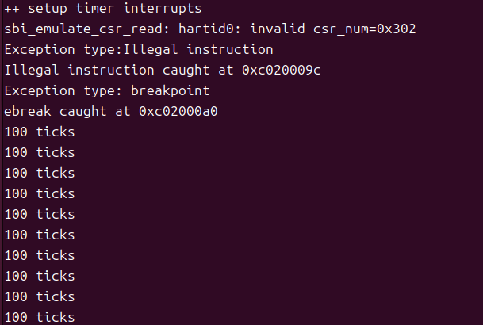

## Lab3

 ## 练习1：完善中断处理 

请编程完善trap.c中的中断处理函数trap，在对时钟中断进行处理的部分填写kern/trap/trap.c函数中处理时钟中断的部分，使操作系统每遇到100次时钟中断后，调用print_ticks子程序，向屏幕上打印一行文字”100 ticks”，在打印完10行后调用sbi.h中的shut_down()函数关机。

要求完成问题1提出的相关函数实现，提交改进后的源代码包（可以编译执行），并在实验报告中简要说明实现过程和定时器中断中断处理的流程。实现要求的部分代码后，运行整个系统，大约每1秒会输出一次”100 ticks”，输出10行。

## 扩展练习 Challenge1：描述与理解中断流程

回答：描述ucore中处理中断异常的流程（从异常的产生开始），其中mov a0，sp的目的是什么？SAVE_ALL中寄寄存器保存在栈中的位置是什么确定的？对于任何中断，__alltraps 中都需要保存所有寄存器吗？请说明理由。

## 扩展练习 Challenge2：理解上下文切换机制

回答：在trapentry.S中汇编代码 csrw sscratch, sp；csrrw s0, sscratch, x0实现了什么操作，目的是什么？save all里面保存了stval scause这些csr，而在restore all里面却不还原它们？那这样store的意义何在呢？

## 扩展练习Challenge3：完善异常中断


编程完善在触发一条非法指令异常和断点异常，在 kern/trap/trap.c的异常处理函数中捕获，并对其进行处理，简单输出异常类型和异常指令触发地址，即“Illegal instruction caught at 0x(地址)”，“ebreak caught at 0x（地址）”与“Exception type:Illegal instruction"，“Exception type: breakpoint”。

首先要触发非法指令异常和断点异常，在init.c中加入两条内联汇编，用来触发非法指令异常和断点异常，要在intr_enable()后添加，确保系统已经准备就绪：

```
asm("mret");
asm("ebreak");
```

`mret`是M模式的特权指令，用于从M模式返回S模式，而此时我们正在S模式，在S模式执行M模式指令就会触发非法指令异常

`ebreak`指令则会触发一个断点异常

接下来在trap.c的异常处理函数中填写代码进行处理，需要先打印出异常的类型，还有异常指令地址，再更新tf->epc寄存器

这里本来直接都用tf->epc+=4来更新，但是在测试ebreak的时候出现问题，在输出断点异常后又去执行后面的print_trapframe(tf)打印了所有的寄存器，查询发现ebreak是一个压缩指令只有2字节，这样epc更新到错误的地方就会进入default，解决方法可以是在前面添加一个判断指令长度的函数，然后根据实际指令长度更新epc的值：

```
static inline int get_inst_len(uintptr_t pc) {
uint16_t inst = *(uint16_t *)pc;
//把地址强制转换为指向16位整数的指针并解引用 读取地址的前2位
return ((inst & 0x3) == 0x3) ? 4 : 2;
//0x3的二进制是11 如果最低2位是11则为4字节标准指令，反之为2字节压缩指令}

case CAUSE_ILLEGAL_INSTRUCTION:
// 非法指令异常处理
/* LAB3 CHALLENGE3   YOUR CODE : 2213523 */
/*(1)输出指令异常类型（ Illegal instruction）
*(2)输出异常指令地址
*(3)更新 tf->epc寄存器
*/
cprintf("Exception type:Illegal instruction\n");
cprintf("Illegal instruction caught at 0x%08x\n", tf->epc);
tf->epc += get_inst_len(tf->epc);
break;
case CAUSE_BREAKPOINT:
//断点异常处理
/* LAB3 CHALLLENGE3   YOUR CODE : 2213523 */
/*(1)输出指令异常类型（ breakpoint）
*(2)输出异常指令地址
*(3)更新 tf->epc寄存器
*/
cprintf("Exception type: breakpoint\n");
cprintf("ebreak caught at 0x%08x\n", tf->epc);
tf->epc += get_inst_len(tf->epc);
break;
```

修改后一切正常，执行qemu后结果如下：



## 知识点总结


