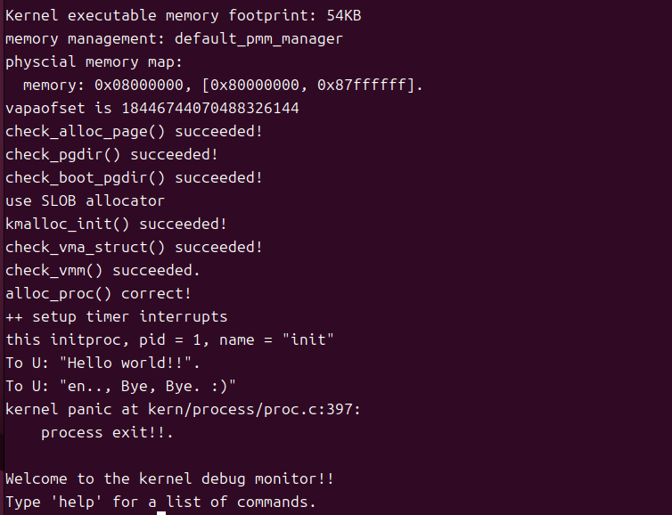

## Lab4

## 练习1：分配并初始化一个进程控制块（需要编码）

alloc_proc函数（位于kern/process/proc.c中）负责分配并返回一个新的struct proc_struct结构，用于存储新建立的内核线程的管理信息。ucore需要对这个结构进行最基本的初始化，你需要完成这个初始化过程。

请在实验报告中简要说明你的设计实现过程。请回答如下问题：

- 请说明proc_struct中`struct context context`和`struct trapframe *tf`成员变量含义和在本实验中的作用是啥？（提示通过看代码和编程调试可以判断出来）

1、初始化进程状态为未初始化 proc->state = PROC_UNINIT;

2、初始化进程ID proc->pid = -1;
      
3、初始化运行次数 proc->runs = 0;
        
4、初始化内核栈地址 proc->kstack = 0;
        
5、初始化调度 proc->need_resched = 0;
        
6、初始化父进程指针 proc->parent = NULL;
        
7、初始化内存管理结构 proc->mm = NULL;
        
8、初始化上下文结构 memset(&(proc->context), 0, sizeof(struct context));
        
9、初始化陷阱帧指针 proc->tf = NULL;
        
10、初始化页目录基址 proc->pgdir = NULL;
        
11、初始化进程标志 proc->flags = 0;
        
12、初始化进程名称 memset(proc->name, 0, PROC_NAME_LEN + 1);

struct context context：进程上下文保存结构，用于进程切换和恢复被调用者时保存寄存器。

struct trapframe *tf：中断帧的指针，总是指向内核栈的某个位置：当进程从用户空间跳到内核空间时，中断帧记录了进程在被中断前的状态。当内核需要跳回用户空间时，需要调整中断帧以恢复让进程继续执行的各寄存器值。
void print_trapframe(struct trapframe *tf) {
    cprintf("trapframe at %p\n", tf);
    print_regs(&tf->gpr);          // 打印所有通用寄存器
    cprintf("  status   0x%08x\n", tf->status);
    cprintf("  epc      0x%08x\n", tf->epc);      // 异常发生时正在执行的指令地址
    cprintf("  badvaddr 0x%08x\n", tf->badvaddr); // 引起异常的地址
    cprintf("  cause    0x%08x\n", tf->cause);    // 异常原因代码
}
## 练习2：为新创建的内核线程分配资源（需要编码）

创建一个内核线程需要分配和设置好很多资源。kernel_thread函数通过调用**do_fork**函数完成具体内核线程的创建工作。do_kernel函数会调用alloc_proc函数来分配并初始化一个进程控制块，但alloc_proc只是找到了一小块内存用以记录进程的必要信息，并没有实际分配这些资源。ucore一般通过do_fork实际创建新的内核线程。do_fork的作用是，创建当前内核线程的一个副本，它们的执行上下文、代码、数据都一样，但是存储位置不同。因此，我们**实际需要"fork"的东西就是stack和trapframe**。在这个过程中，需要给新内核线程分配资源，并且复制原进程的状态。你需要完成在kern/process/proc.c中的do_fork函数中的处理过程。它的大致执行步骤包括：

- 调用alloc_proc，首先获得一块用户信息块。
- 为进程分配一个内核栈。
- 复制原进程的内存管理信息到新进程（但内核线程不必做此事）
- 复制原进程上下文到新进程
- 将新进程添加到进程列表
- 唤醒新进程
- 返回新进程号

请在实验报告中简要说明你的设计实现过程。

`do_fork`函数用来完成具体内核线程的创建工作，主要完成下面7件事：

1.首先调用练习1写的 `alloc_proc()`，获取一个 `proc_struct` 结构体，如果分配失败则返回 `NULL`，然后 `goto fork_out` 。并将新进程 `proc` 的 `parent` 字段指向 `current`，即`idleproc`。

```
    // LAB4:EXERCISE2 2213523
    //    1. call alloc_proc to allocate a proc_struct
    if ((proc = alloc_proc()) == NULL) {
    goto fork_out;
}
    // 将新进程的父进程设置为当前进程
    proc->parent = current; 
```

2.分配内核栈，调用 `setup_kstack`，它会分配 `KSTACKPAGE` 个物理页，并将其虚拟地址存入 `proc->kstack`，如果内存不足则跳转到 `bad_fork_cleanup_proc`。

```
    //    2. call setup_kstack to allocate a kernel stack for child process
    if (setup_kstack(proc) != 0) {
    goto bad_fork_cleanup_proc;
}
```

3.复制原进程的内存管理信息到新进程，因为这里是内核线程，copy_mm函数目前只是把current->mm设置为NULL，在后续实验中，这里会根据 `clone_flags` 决定是复制（`fork`）还是共享（`clone`）用户地址空间，如果 `copy_mm` 失败，则跳转到 `bad_fork_cleanup_kstack`。

```
    //    3. call copy_mm to dup OR share mm according clone_flag
    if (copy_mm(clone_flags, proc) != 0) {
    goto bad_fork_cleanup_kstack;
}
```

4.复制原进程上下文到新进程，调用 `copy_thread`，传入新进程 `proc`、`stack` (为0) 和 `tf` ， `copy_thread`函数给子进程分配空间，并复制中断帧`tf`，再将`a0`返回值设置为0，将返回地址`ra`设置到`forkret`并设置内核栈指针`sp`到`tf`

```
    //    4. call copy_thread to setup tf & context in proc_struct
    copy_thread(proc, stack, tf);
```

5.将新进程添加到进程列表，首先调用 `get_pid()` 获取一个保证唯一的PID，再将 `proc` 添加到哈希表`hash_list`中，接着将 `proc`添加到全局进程列表`proc_list`，并`nr_process++`将进程总数+1。

```
    //    5. insert proc_struct into hash_list && proc_list
    proc->pid = get_pid(); // 获取唯一的PID
    hash_proc(proc);       // 添加到哈希列表
    // 添加到全局进程列表
    list_add(&proc_list, &(proc->list_link)); 
    nr_process++;
```

6.唤醒新进程，将进程状态从 `PROC_UNINIT` 修改为 `PROC_RUNNABLE`， `schedule()` 函数现在可以选中这个进程来运行了。

```
    //    6. call wakeup_proc to make the new child process RUNNABLE
    //wakeup_proc 的作用是设置状态
    proc->state = PROC_RUNNABLE; 
```

7.返回新进程号，将返回值 `ret` 从 `-E_NO_MEM` 覆盖为新进程的 `pid`。

```
    //    7. set ret vaule using child proc's pid
    ret = proc->pid;
```

这样，我们的内核进程initproc就创建完毕了，等待开始运行。

请回答如下问题：

- 请说明ucore是否做到给每个新fork的线程一个唯一的id？请说明你的分析和理由。

uCore 能够确保每个新 fork 的线程都获得一个唯一的 ID，因为proc.c中的 `get_pid()` 函数，可以用来分配唯一的id。

在函数中，last_pid用于记录上次分配的 PID，next_safe用于记录下一个 已知的被占用的 PID，首先尝试下一个 PID，将`last_pid` 加 1，如果 `last_pid` 超过了最大值，会回绕到 1并goto inside。之后检查新选的 `last_pid` 是否“撞”上了 `next_safe` 缓存，如果小于则可以返回，如果大于等于则需要再判断。首先`next_safe` 重置为最大值，再重新扫描链表，遍历`proc_list` 上的每一个进程，如果发现选择的 `last_pid`已经被占用，则尝试递增 `last_pid` 并从头重新开始整个扫描（`goto repeat`），直到找到一个确认未被占用的PID为止，这样可以保证每个新 fork 的线程都获得一个唯一的 ID。

## 练习3：编写proc_run 函数（需要编码）

proc_run用于将指定的进程切换到CPU上运行。它的大致执行步骤包括：

- 检查要切换的进程是否与当前正在运行的进程相同，如果相同则不需要切换。
- 禁用中断。你可以使用`/kern/sync/sync.h`中定义好的宏`local_intr_save(x)`和`local_intr_restore(x)`来实现关、开中断。
- 切换当前进程为要运行的进程。
- 切换页表，以便使用新进程的地址空间。`/libs/riscv.h`中提供了`lsatp(unsigned int pgdir)`函数，可实现修改SATP寄存器值的功能。
- 实现上下文切换。`/kern/process`中已经预先编写好了`switch.S`，其中定义了`switch_to()`函数。可实现两个进程的context切换。
- 允许中断。


1. 检查要切换的进程是否与当前正在运行的进程相同，如果相同则不需要切换。  
```c
if (proc != current)
{
    ...
}
```
当 `proc == current` 时函数直接返回，不做任何操作，避免不必要的上下文切换开销。

2. 禁用中断，保存并关闭中断。使用 `local_intr_save(x)` 保存并关闭中断，避免在切换过程中被中断打断。  
```c
bool intr_flag;
local_intr_save(intr_flag);
```
`intr_flag` 用于保存调用前的中断使能状态，之后会用 `local_intr_restore(intr_flag)` 恢复原状态；在此范围内执行上下文切换可避免并发与抢占问题。

3. 切换当前进程为要运行的进程，更新全局 `current` 指针。  
```c
struct proc_struct *prev = current;
current = proc;
```
先把原来的 `current` 保存到 `prev`，再把 `current` 指向新的 `proc`，这样后续的切换操作和任何对 `current` 的查询都会看到新的进程。

4. 切换页表，以便使用新进程的地址空间。使用 `lsatp((unsigned int)proc->pgdir)` 修改 SATP。  
```c
lsatp((unsigned int)proc->pgdir);
```
LSATP，或此处的 `lsatp` 辅助函数，将 SATP 寄存器设置为指定进程的页表基址，使 CPU 采用该进程的虚拟地址映射。通常在上下文切换前切换页表以确保新进程运行时的内存访问正确。

5. 实现上下文切换。调用 `switch_to(&prev->context, &proc->context)`，由汇编例程在 `switch.S` 中完成实际寄存器与栈指针保存/恢复。  
```c
switch_to(&prev->context, &proc->context);
```
`switch_to` 会把当前（prev）进程的 callee-saved 寄存器和栈指针保存到 `prev->context`，并从 `proc->context` 恢复寄存器与栈，从而把 CPU 的执行上下文切换到新进程。

6. 允许中断（恢复原中断状态）。使用 `local_intr_restore(x)` 恢复先前保存的中断状态。  
对应代码：
```c
local_intr_restore(intr_flag);
```
恢复之前保存的中断使能标志。如果切换前中断是允许的，则恢复允许；如果之前禁用，则保持禁用，保证语义一致。

完整的代码块如下
```c
void proc_run(struct proc_struct *proc)
{
    if (proc != current)
    {
        bool intr_flag;
        struct proc_struct *prev = current;
        local_intr_save(intr_flag);
        {
            current = proc;
            lsatp((unsigned int)proc->pgdir);
            switch_to(&prev->context, &proc->context);
        }
        local_intr_restore(intr_flag);
    }
}
```

另外：
- 把 `lsatp` 放在 `switch_to` 之前，是为了保证当 CPU 恢复到新上下文并开始执行时，页表已经是新进程的页表，避免地址映射冲突或 TLB 问题。部分实现也可能在恢复后立即执行 `sfence.vma`，但本实验框架通过 `lsatp` 与后续指令保证一致性。
- `local_intr_save`/`local_intr_restore` 的粒度应尽量小，只保护必要的上下文切换段，避免长时间禁中断影响系统响应。
- `switch_to` 的实现细节由汇编完成。在 fork 场景中，`copy_thread` 已把 `proc->context` 的 `ra` 指向 `forkret`，所以子进程第一次被调度时会从 `forkret` 进入内核后续逻辑。


请回答如下问题：

- 在本实验的执行过程中，创建且运行了几个内核线程？

按照 kern/process/proc_init() 的初始化流程，系统在引导时创建并运行的内核线程为**两**个：

第一个内核线程：idleproc（idle）。proc_init() 通过 alloc_proc() 创建 idleproc，并把 current = idleproc，这是第一个、并且立即成为当前运行的内核线程。
第二个内核线程：init_main（init）。proc_init() 调用 kernel_thread(init_main, "Hello world!!", 0) 来创建第二个内核线程；随后该线程会被调度并运行，initproc。
因此，初始阶段创建并会被运行的内核线程数为 2，idle 与 init。

完成代码编写后，编译并运行代码：make qemu


## 扩展练习 Challenge1

说明语句`local_intr_save(intr_flag);....local_intr_restore(intr_flag);`是如何实现开关中断的？

在sync.h中定义一个内联函数 __intr_save保存当前中断状态并禁用中断

static inline bool __intr_save(void) {
    if (read_csr(sstatus) & SSTATUS_SIE) {
        // 检查 sstatus 寄存器的 SIE 位是否为 1，表示中断是否启用
        intr_disable();// 如果 SIE 位为 1，则调用 intr_disable 函数禁用中断
        return 1;
    }
    return 0;
}

定义一个内联函数 __intr_restore来根据状态恢复中断

static inline void __intr_restore(bool flag) {
    if (flag) {// 检查 flag 参数是否为 true
        intr_enable();// 如果 flag 为 true，则调用 intr_enable 函数重新启用中断
    }
}

#define local_intr_save(x) \  //用于保存当前中断状态并禁用中断
    do {                   \
        x = __intr_save(); \  //调用 __intr_save 函数，将当前中断状态保存到变量 x 中，同时禁用中断
    } while (0)
#define local_intr_restore(x) __intr_restore(x);//定义一个宏 local_intr_restore，根据保存的状态 x 恢复中断

void intr_enable(void) { set_csr(sstatus, SSTATUS_SIE); }

void intr_disable(void) { clear_csr(sstatus, SSTATUS_SIE); }
具体调用关系如下
关中断local_intr_save --> __intr_save --> intr_disable --> cli

开中断local_intr_restore–> __intr_restore --> intr_enable --> sti

## 扩展练习 Challenge2

深入理解不同分页模式的工作原理（思考题）

get_pte()函数（位于`kern/mm/pmm.c`）用于在页表中查找或创建页表项，从而实现对指定线性地址对应的物理页的访问和映射操作。这在操作系统中的分页机制下，是实现虚拟内存与物理内存之间映射关系非常重要的内容。


- get_pte()函数中有两段形式类似的代码， 结合sv32，sv39，sv48的异同，解释这两段代码为什么如此相像。

  多级页表是一个树状结构，除了最后一级页表指向真正的物理数据页外，中间每一级页表 PTE 都包含下一级页表的物理地址，get_pte()函数会在每一级页表都是先检查下一级存不存在，如果不存在且需要创建，就申请一个新页作为下一级页表，将新页的物理地址填进去并继续向下，这样通过PTE中的物理地址找到页表的位置，再通过la对应的9位找到具体位置，最终找到第三级页表中对应位置的地址。

  这两段代码分别处理了第一级页表和第二级页表，逻辑上是一样的。

  ```
  // 第一段：处理第一级页表
  pde_t *pdep1 = &pgdir[PDX1(la)];
  if (!(*pdep1 & PTE_V)) { ... alloc_page ... }
  
  // 第二段：处理第二级页表
  pde_t *pdep0 = &((pde_t *)KADDR(PDE_ADDR(*pdep1)))[PDX0(la)];
  if (!(*pdep0 & PTE_V)) { ... alloc_page ... }
  ```

  sv32是2级页表，结构是：`页目录(PD)` -> `页表(PT)` -> `物理页`，只需要一段这样的代码。

  sv39是本实验的结构，是3级页表，结构：`L2页表` -> `L1页表` -> `L0页表` -> `物理页`，所以需要两段这样的代码。

  sv48是4级页表，结构：`L3` -> `L2` -> `L1` -> `L0` -> `物理页`，需要三段这样的代码。

  代码的重复次数是页表层级数-1。

- 目前get_pte()函数将页表项的查找和页表项的分配合并在一个函数里，你认为这种写法好吗？有没有必要把两个功能拆开？

  通过create，将查找和分配合并在一起，如果create为0则只查找，为1则查找并分配。

  这种写法较好，性能较高并可以避免代码冗余，缺点是可读性比较差。

  如果拆成 `find_pte` 和 `alloc_pte`，调用 `alloc_pte` 时，必须从根节点重新走一遍流程才能找到缺页的地方，性能较低，并且如果以后需要修改时需要两个函数一起修改，较为麻烦。


## 总结

虽然执行make qemu后只输出了几行cprintf，但是整个过程中操作系统内核完成了复杂的线程创建和交接，下面是简化的执行过程：

1.`kern_init`启动内核，执行一系列初始化，调用 `proc_init()`创建了第一个线程`idleproc`

2.`proc_init`继续执行，调用 `kernel_thread(init_main, "Hello world!!", 0)`伪造了一些寄存器，创建第二个线程 `initproc`，调用`do_fork`完成具体内核线程的创建工作，之后`proc_init` 执行完毕，返回到 `kern_init`。

3.`kern_init` 的所有初始化工作完成后调用 `cpu_idle()`，判断`current->need_resched`是1，调度器`schedule()`触发。

4.调度器 `schedule`通过遍历 `proc_list`找到 `initproc`，将状态设置为`PROC_RUNNABLE`，并运行`proc_run(next)`（即 `proc_run(initproc)`）。

5.`proc_run` 执行切换，调用`switch_to`进行线程的切换，`ret` 指令使 CPU 跳转到 `ra`即 `forkret`，调用`forkrets`将 `sp` 设置为 `initproc` 的 `tf` 地址，再跳转到`__trapret`恢复伪造的寄存器，之后`sret`从中断返回，使 CPU 跳转到 `epc`即 `kernel_thread_entry`，将a0设置为s1，即参数`"Hello world!!"`，跳转到s0即`init_main`，并设置 `ra` = `jal do_exit`。

6.`init_main`开始运行，打印输出，返回到`do_exit`。

**知识点**：

1.进程控制块 (PCB) `struct proc_struct` 

2.进程状态模型 实验中进程状态有四种， `enum proc_state` ( `PROC_UNINIT`, `PROC_RUNNABLE`, `PROC_SLEEPING`, `PROC_ZOMBIE` ) 实验中的就绪态同时包含了理论上的就绪态和运行态，而未初始化态则对应 `alloc_proc` 之后、`do_fork` 完成之前时的中间态。

3.`do_fork()` 函数创建进程，本次实验都是在内核态完成。

4.进程调度与分派 `schedule()` (调度器) 负责决策和 `proc_run()` (分派器)负责执行。实验目前没有实现理论的时间片轮转，选中了哪个线程就独占CPU直到退出。

5.上下文切换  `switch_to()` 函数和 `struct context` 实验中只要手动保存被调用者保存寄存器即可。

6.内核栈与中断帧，区分`context` 和 `tf` 。

7.进程地址空间


