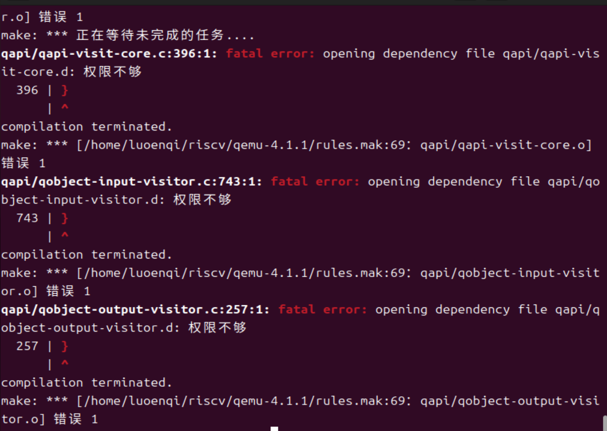

# 分支任务：gdb 调试页表查询过程

## 准备带调试信息的QEMU
正常按照实验手册指导安装，期间可能会遇到报错，如下

这是权限问题
修复目录所有权 进入源码目录的上一级目录，然后递归地将整个 qemu-4.1.1目录及其所有文件的所有权改回您的用户。假设您的用户名就是 user： 
cd /home/user/riscv/
sudo chown -R user:user qemu-4.1.1/
•	sudo：因为有些文件当前属于 root，需要提权才能更改其所有者。 
•	chown：更改文件所有者命令。 
•	-R：递归操作，应用于目录内的所有文件和子目录。 
•	user:user：第一个是用户名，第二个是用户组名（通常与用户名相同）。 

## 要求1
尝试理解我们调试流程中涉及到的qemu的源码，给出关键的调用路径，以及路径上一些关键的分支语句（不是让你只看分支语句），并通过调试演示某个访存指令访问的虚拟地址是如何在qemu的模拟中被翻译成一个物理地址的。

进入tmux模式后，分割出三个终端，实验步骤如下

终端 1 :
``` 
make debug 
```
启动后挂起

终端 2 :
```
pgrep -a qemu       # 找 PID
sudo gdb            # 进 GDB
attach <PID>        # 连 QEMU
handle SIGPIPE nostop noprint
continue            # 让它先跑起来等待
```

终端 3 :
```
make gdb
set remotetimeout unlimited # 保证时序同步不断开
```

我们需要让操作系统停在“马上要写内存”的那一刻。
在终端3中继续输入
```
break kern_init      # 在内核初始化入口打断点
continue             # 运行到断点
```
终端1发生变化，显示停在kern_init
终端3
```
p /x edata           # 查看原本打算写入的虚拟地址
```
会有
```
$1 = 0xffffffffc0205018<free_area>
```

现在趁内核停住了，我们在硬件层埋下陷阱，拦截翻译请求。
终端2：
```
Ctrl + C                     # 1. 暂停 QEMU 运行
break get_physical_address   # 2. 拦截地址翻译函数
continue                     # 3. 恢复运行，静待猎物
```


终端3
```
step                 # 单步执行，迫使内核执行访存指令
```
按下回车后，中断2立刻触发断点。
得到结果
```
Thread 1 "qemu-system-ris" hit Breakpoint 1, get_physical_address (
    env=0x5faf43389040,
    physical=0x7ffd8d8193d8,
    prot=0x7ffd8d8193d0,
    addr=18446744072637906944,
    access_type=0, mmu_idx=1)
    at /home/luoengi/riscv/qemu-4.1.1/target/riscv/cpu_helper.c:158
```


此时终端 2 停在 `get_physical_address` 入口。

终端2：

```
p /x addr
```
会有
```
$1 = 0xffffffffc0200000
``` 
这就是内核发出的虚拟地址,记录下来。

现在我们需要获取物理地址，要让函数跑完计算结果。
终端2：
```
finish
```
GDB 会显示 `Run till exit from ...` 并停在调用它的上级函数里。


回到上级函数后，结果存放在 `phys_addr` 指针指向的变量里。

终端2：

```
p /x phys_addr
```
记录： `$3 = 0x80200000` ，这就是翻译后的物理地址。

要点总结：
- 调用路径：从 QEMU 执行到触发访存的指令开始，控制流进入目标架构的内存访问/翻译逻辑，最终到达 `target/riscv/cpu_helper.c` 中的 `get_physical_address`。`get_physical_address` 会先根据当前特权级和 `satp` 判断是否直接恒等映射或进入页表翻译；若使用软件 TLB，会先尝试在 TLB 中查找；TLB 未命中时调用 `riscv_cpu_tlb_fill` 完成页表遍历并通过 `tlb_set_page` 写入 TLB。实际读取物理内存的操作（例如取 PTE、读取目标数据）由 `ldq_phys` 或者内存区域读取接口完成。
- 关键分支语句：判断特权级的分支（例如 `if (mode == PRV_M)`）会在 M 模式直接把虚拟地址当作物理地址返回；判断 `satp` 模式的分支决定是否启用 SV39 页表遍历；页表遍历循环内部对每级 PTE 的有效位与权限位的判断（例如检测 `PTE_V`，判定是否为 leaf `PTE_R|PTE_X`）决定是继续向下查表还是把该 PTE 作为叶子映射处理。


## 要求2


直到Step以前的部分 都一样 终端3 step之后

现在停在 `get_physical_address` 入口，不必进行`finish`，而是进行单步调试


单步 `n` 几次，直到看到代码读取 `env->satp` ，或者说是进入函数刚开始的地方。 输入以下命令查看 SATP：
终端2：
```
p /x env->satp
```
得到
```
$1 = 0x8000000000080204
```
Mode: 0x8 → SV39分页模式​
PPN: 0x80204（satp低44位）
根页表物理地址: 0x80204 × 4096 = 0x80204000


现在我们需要走到`ldq_phys`上，于是设置断点。
终端2：
```
tbreak ldq_phys
continue
```
此时，GDB显示停在了函数ldq_phys的入口。
我们要让这个读取函数执行完，并让 GDB 自动吐出读取到的值（PTE）。


终端2：
```
finish
```

屏幕上出现如下一行：

`Value returned is $2 = 536871119` (十进制)

这个 `$2` 就是页表项(PTE)


```
p /x $2            # 看十六进制 
```
$3 = 0x200000cf
```
p /x ($2 & 0xe)    # 看权限位 
```
$4 = 0xe

对 PTE `0x200000cf` 进行位域分析：

- Valid 位 (Bit 0): 最低位是 `f` (1111)，即 V=1，表示该页表项有效。
- 权限位 (Bit 1-3): `0xe` (1110) $\rightarrow$ R=1, W=1, X=1。
- 结论：根据 RISC-V 规范，当 R、W、X 中有任意一位为 1 时，该节点为叶子节点（Leaf Page）。
- 由于这是在第一级（Level 2）查找时发现的叶子节点，因此这是一个 1GB 的大页，硬件无需继续查找二级和三级页表。

直接 `finish` 此时查看：
```
p /x phys_addr
```
验证最终物理地址`$6 = 0x80200000`与要求1中计算的一样。

通过利用 GDB 的 finish 指令捕获 ldq_phys 的返回值，成功拦截了硬件读取页表项的瞬间。解码 PTE 0x200000cf 的权限位 (0xe) 直接证明了 uCore 启动时使用了 1GB 大页映射策略，将内核虚拟空间直接映射到了物理内存起始位置 0x80200000。

页表遍历逐步解释：
- 总体思路：SV39 使用三级页表，翻译从最高级别（level = 2）开始向下搜索。每级循环的核心是计算索引、读取该索引对应的 PTE、判断该 PTE 是否有效和是否为叶子项。如果不是叶子项，就把 PTE 中的物理页号作为下一层页表的基址继续循环；如果是叶子项，就根据叶子所在级别计算最终物理地址并做权限检查。
- 三个循环在做什么：循环变量通常从 2 递减到 0，level 值决定要使用虚拟地址的哪 9 位作为索引。每次迭代计算 index = (va >> (12 + 9*level)) & 0x1ff，然后读取物理内存中根页表加上 index*8 的 8 字节 PTE。
- 那两行操作的含义：`pte = ldq_phys(root + index*8)` 是从物理内存读取当前页表项；随后常见的判断 `if (pte & (PTE_R | PTE_X))` 或 `if (!(pte & PTE_V))` 分别用来检测是否为叶子项或是否无效。若为叶子项，则根据该级别构造物理地址：把 PTE 的 PPN 左移 12，再把虚拟地址的低若干位作为偏移拼接进来；若为非叶子项则将 PPN 左移 12 得到下一层页表的物理基址并继续。


## 要求3

准备工作与要求1一致。


首先仍然需要诱捕。
还是用 `kern_init` 写内存来触发，这个最经典。

中断3
```
break kern_init
continue
```
停在 kern_init 后

在终端 2 输入：
```
Ctrl + C
break riscv_cpu_tlb_fill
```
这是入口：TLB Miss 发生的地方
为了看清全过程，我们再加一个断点，使之能停在最后一步，抓表：

终端2
```
break tlb_set_page
```
这是出口：把算好的物理地址存进缓存的地方
```
continue
```


在终端3输入
```
step
```
终端 2 应该会立刻触发 `riscv_cpu_tlb_fill`
断下来后，可以看到终端2停在 `riscv_cpu_tlb_fill`。 

终端2
```
p /x address
```
`$1 = 0xffffffffc0203ff8`
是为了这个地址报错


我们跳到填表最后一步观察
终端2
```
continue
```
GDB 会跑过中间查表的过程，再次停下来，这次停在 `tlb_set_page`


现在停在 `tlb_set_page` 了，说明物理地址已经算好了，正准备往 TLB 里写。 我们要验证写进去的数据对不对。

输入：
```
p /x vaddr    # 虚拟地址
p /x paddr    # 物理地址
```
得到
```
(gdb) p /x vaddr
$2 = 0xffffffffc0203000  # 虚拟地址
(gdb) p /xpaddr
$3 = 0x80203000  # 物理地址

TLB 查找与源码位置：
- 在 QEMU 的 RISC‑V 实现中，TLB 是以软件结构模拟的缓存。常见的调用顺序是在 `get_physical_address` 中先尝试从软件 TLB 查找映射，若查不到则调用 `riscv_cpu_tlb_fill` 触发页表遍历，遍历结束后通过 `tlb_set_page` 将计算出的映射写入 TLB。可以在源码的 `target/riscv/cpu_helper.c` 中找到 `riscv_cpu_tlb_fill` 和 `tlb_set_page` 的实现，并在 `get_physical_address` 附近观察到 TLB 查询／分支逻辑。
- 调试要点：如已有步骤，先在 `riscv_cpu_tlb_fill` 打断点观察 TLB miss 时传入的虚拟地址与上下文信息，再在 `tlb_set_page` 打断点确认写入的虚拟/物理映射以及相关 ASID 或权限字段。

```

## 要求4

与要求1类似，首先在终端3
```
break kern_init
continue
```
接着在终端2
```
break get_physical_address
continue 
```
终端3：
```
step
```
然后在终端2
一直n

`if (mode == PRV_M ...)`：判定是 M 模式。

`*physical = addr;`：直接让物理地址等于虚拟地址（恒等映射）。

`return TRANSLATE_SUCCESS;`：直接返回，

整个过程跳过了后续的 SATP 读取和多级页表遍历循环。

QEMU TLB 与真实 CPU 的逻辑差异：
- QEMU 中的 TLB 是软件层面的快速缓存，主要用于减少频繁的页表遍历开销。它通常以简化的结构实现，条目中会包含虚拟页号、物理页号、权限位和可能的 ASID 信息，但并不模拟硬件 TLB 的所有微观行为，例如多级或多端口并发访问、具体的替换策略、以及与缓存/乱序执行的精确时序影响。
- 在调试时的可见差别：当虚拟地址空间未启用或处于 M 模式时，`get_physical_address` 通过 `if (mode == PRV_M)` 直接返回恒等映射，既不查 TLB 也不做页表遍历。开启虚拟地址后，通常先查 TLB，再在 miss 时走页表遍历并填表。真实 CPU 的 TLB 有更复杂的层次、关联度和一致性/失效语义，这些在 QEMU 中一般被简化为软件操作，便于仿真但不能复刻所有性能和并发行为。

