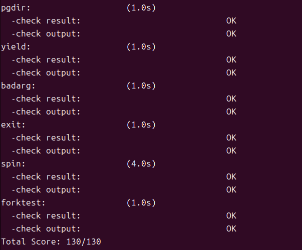

## Lab5

## 前置工作

在lab4中，我们创造了两个内核进程，lab5则是创造了一个用户进程，通过`ebreak`在内核态触发异常，借助异常处理机制的返回流程进行上下文切换，从而第一次进入到用户进程，并实现了系统调用。

需要补充代码：

- 在trap.c中`case IRQ_S_TIMER:`部分：

  ```
  clock_set_next_event();
  ticks++;
  if (ticks % TICK_NUM == 0)
   {
     if (current != NULL)//确保当前有进程在运行
      {
         current->need_resched = 1;//标记：该进程时间片用完了，申请调度
      }
   }
  break;
  ```

- 在proc.c中`alloc_proc`函数，增加：

  ```
  // 1. 初始化等待状态
  // 0 表示没有在等待任何事情
  proc->wait_state = 0;
  // 2. 初始化家族指针
  // 刚出生的进程没有孩子，也没有被挂到兄弟链表上，所以全是 NULL
  proc->cptr = NULL;  // 没有孩子 (Child Pointer)
  proc->optr = NULL;  // 没有哥哥 (Older Sibling Pointer)
  proc->yptr = NULL;  // 没有弟弟 (Younger Sibling Pointer)
  ```

  新创建的进程默认处于就绪或运行状态，没有在等待任何事件，因此将其初始化为 0。

  使用二叉链表的变体来管理复杂的进程族谱树：

  `parent`：指向父进程。

  `cptr`：指向该进程的最年轻的子进程即链表头，父进程通过它找到自己的孩子。

  `yptr`：指向比当前进程更年轻的兄弟进程，上一个节点。

  `optr`：指向比当前进程更年长的兄弟进程，下一个节点。

  `optr` 和 `yptr` 将同一个父进程下的所有子进程串成了一个双向链表，而父进程通过 `cptr` 抓住这个链表的头部。

  ```
  [父进程]
     | (cptr)
     V
  [子进程 A] <--(yptr/optr)--> [子进程 B] <--(yptr/optr)--> [子进程 C]
  ```

- 在do_fork函数，增加：

  ```
  proc->parent = current;  // 设置新进程的父亲为当前进程
  // 确保当前进程（父进程）的 wait_state 是 0
  assert(current->wait_state == 0);
  ```

  ```
  bool intr_flag;
  local_intr_save(intr_flag);  // 必须关中断,因为要操作全局链表，防止被打断
   {
    proc->pid = get_pid();   // 给孩子分配一个唯一的 PID
    hash_proc(proc);         // 把孩子加入 PID 哈希表，方便通过 PID 查找
    set_links(proc);       //调用
   }
  local_intr_restore(intr_flag); // 恢复中断
  ```

  `set_links(proc)`这是构建进程关系的核心函数。它完成了三件事：

  - 将 `proc` 插入到全局进程链表 `proc_list` 中，使其能被调度器识别。
  - 设置 `proc` 的 `cptr`, `yptr`, `optr`，将其挂载到父进程的子进程链表中，作为最新的子进程，将新进程接入了进程树结构。
  - 将进程总数加一。

## 练习1: 加载应用程序并执行（需要编码）

**do_execve**函数调用`load_icode`（位于kern/process/proc.c中）来加载并解析一个处于内存中的ELF执行文件格式的应用程序。你需要补充`load_icode`的第6步，建立相应的用户内存空间来放置应用程序的代码段、数据段等，且要设置好`proc_struct`结构中的成员变量trapframe中的内容，确保在执行此进程后，能够从应用程序设定的起始执行地址开始执行。需设置正确的trapframe内容。

请在实验报告中简要说明你的设计实现过程。

```
tf->gpr.sp = USTACKTOP;// 1. 设置用户栈指针
tf->epc = elf->e_entry;// 2. 设置程序入口地址
tf->status = (read_csr(sstatus) & ~SSTATUS_SPP) | SSTATUS_SPIE;// 3. 设置特权级和中断状态
```

设置trapframe内容：

- 设置用户栈指针 (`tf->gpr.sp = USTACKTOP`)：

  在之前的步骤中，我们已经建立了用户栈的内存映射，范围为 `[USTACKTOP - USTACKSIZE, USTACKTOP)`。

  RISC-V 中栈是向下增长的，因此我们需要将通用寄存器中的栈指针 `sp` 初始化为用户栈的最高地址 `USTACKTOP`，确保用户程序有合法的栈空间可用。

- 设置入口地址 (`tf->epc = elf->e_entry`)：

  `epc` 寄存器保存了发生异常时的指令地址，是在执行 `sret` 返回时 CPU 即将跳转到的地址。

  将 ELF 文件头中记录的程序入口地址 `e_entry` 赋值给 `epc`，这样=当从内核态返回时，PC 指针就会指向应用程序的第一条指令。

- 设置状态寄存器 (`tf->status`)：

  清除 SPP 位 (`& ~SSTATUS_SPP`)：`SPP`位记录了进入异常前的特权级别，我们希望从内核返回后进入用户模式 (User Mode)，因此须将此位清零。

  置位 SPIE 位 (`| SSTATUS_SPIE`)：`SPIE` 位记录了进入异常前中断是否开启，我们希望用户程序运行时能够响应中断，因此须将此位置 1。当执行 `sret` 时，硬件会将 `SPIE` 的值复制给 `SIE` ，从而开启中断。

请简要描述这个用户态进程被ucore选择占用CPU执行（RUNNING态）到具体执行应用程序第一条指令的整个经过。

1. 创建与调度

   创建：`init` 进程在 `init_main` 中调用 `kernel_thread`，通过 `do_fork` 创建一个新的内核线程 `user_main`，并将其状态设置为 `PROC_RUNNABLE` 。

   等待：`init` 进程随后调用 `do_wait` 进入休眠，并在 `schedule` 中让出 CPU 。

   调度：调度器选中这个新的内核线程，通过 `proc_run` -> `switch_to` 切换上下文，之后跳转到`forkrets`切换中断帧恢复寄存器，最终开始执行 `user_main` 函数 。

2. 加载应用程序

   发起调用：在 `user_main` 函数中，执行宏 `KERNEL_EXECVE(exit)`，通过内联汇编执行 `ebreak` 指令，触发断点异常，从而在内核态发起系统调用 。

   异常分发：CPU 跳转到 `__alltraps` -> `trap` ，在 `exception_handler` 中识别出断点异常，调用 `syscall` 。

   执行 Exec ：`syscall` 根据参数分发到 `sys_exec`，进而调用 `do_execve` 。

   加载内存：`do_execve` 销毁当前的内存空间，并调用 `load_icode` 加载 `exit` 程序的 ELF 文件。`load_icode` 会建立新的用户内存空间（代码段、数据段、BSS、用户栈），并关键地设置了 `current->tf` 中断帧，设置`epc`为应用程序第一条指令地址。

3. 切换与执行

   中断返回：`do_execve` 返回后，中断处理流程结束，执行 `kernel_execve_ret`，跳转到`__trapret`（位于 `trapentry.S`）。

   恢复现场：`__trapret` 从内核栈的 `TrapFrame` 中恢复通用寄存器。

   特权级切换：执行 `sret` 指令。CPU 根据 `sstatus` 的设置从内核态切换到用户态并将 PC 跳转到 `sepc`，即 `epc` 中保存的 ELF 入口地址 。

   执行：CPU 开始执行用户程序 `exit.c` 的第一条指令。

## 练习2: 父进程复制自己的内存空间给子进程（需要编码）

创建子进程的函数`do_fork`在执行中将拷贝当前进程（即父进程）的用户内存地址空间中的合法内容到新进程中（子进程），完成内存资源的复制。具体是通过`copy_range`函数（位于kern/mm/pmm.c中）实现的，请补充`copy_range`的实现，确保能够正确执行。

请在实验报告中简要说明你的设计实现过程。

将父进程的内容拷贝到子进程中，`page`是父进程对应的物理页，`npage`是为子进程分配的新页。

```
void *src_kvaddr = page2kva(page);
void *dst_kvaddr = page2kva(npage);
memcpy(dst_kvaddr, src_kvaddr, PGSIZE);
ret = page_insert(to, npage, start, perm);
```

- 首先调用 `page2kva()` 函数，将父进程的源物理页 `page`和子进程的新物理页 `npage`转换为内核可以直接访问的虚拟地址 `src_kvaddr` 和 `dst_kvaddr`。
- 调用 `memcpy(dst_kvaddr, src_kvaddr, PGSIZE)`，将父进程该物理页内的全部 4096 字节（PGSIZE）数据，复制到子进程新分配的物理页中。
- 调用 `page_insert(to, npage, start, perm)` 更新子进程的页表，在子进程的页表 `to`中，把虚拟地址 `start` 映射到物理页 `npage`，同时赋予它权限 `perm`。

如何设计实现`Copy on Write`机制？给出概要设计，鼓励给出详细设计。

当一个用户父进程创建自己的子进程时，父进程会把其申请的用户空间设置为只读，子进程可共享父进程占用的用户内存空间中的页面。当其中任何一个进程修改此用户内存空间中的某页面时，ucore会通过page fault异常获知该操作，并完成拷贝内存页面，使得两个进程都有各自的内存页面，这样一个进程所做的修改不会被另外一个进程可见。

- 修改 `do_fork` 调用的 `copy_range` 函数，实现共享映射和只读权限设置，不再为子进程分配新的物理页，而是将子进程的虚拟地址映射到父进程的同一个物理页，并把权限全部设置为只读。
- 增加缺页异常处理，需要判断并处理 COW 异常，当进程修改此用户内存空间中的页面时触发一次，如果只有当前进程在使用该物理页，则无需复制，直接恢复写权限；如果引用计数大一1，则需要申请新物理页并复制数据，建立新映射，加上写权限。

## 练习3: 阅读分析源代码，理解进程执行 fork/exec/wait/exit 的实现，以及系统调用的实现（不需要编码）

请在实验报告中简要说明你对fork/exec/wait/exit函数的分析。并回答如下问题：

请分析fork/exec/wait/exit的执行流程。重点关注哪些操作是在用户态完成，哪些是在内核态完成？内核态与用户态程序是如何交错执行的？内核态执行结果是如何返回给用户程序的？

- ```
  static int
  sys_fork(uint64_t arg[]) {
      struct trapframe *tf = current->tf;
      uintptr_t stack = tf->gpr.sp;
      return do_fork(0, stack, tf);
  }
  ```

  `fork()`->`sys_fork()`->`do_fork()`

  `do_fork`函数：创建子进程 ，完成了父进程到子进程的复制和初始化工作。

  检查当前系统中的进程数量 `nr_process` 是否已经达到了最大限制，之后调用 `alloc_proc()` 函数申请一块内存，用于存放新进程的进程控制块PCB。

  设置父进程，将新进程的父进程指针指向当前进程`current`，并确保当前父进程没有处于等待状态。调用 `setup_kstack(proc)`分配内核栈，调用copy_mm()复制或共享内存空间。

  之后调用`copy_thread(proc, stack, tf)`设置中断帧和上下文，将新进程分配PID，插入链表并建立进程关系`set_links(proc)`。最后修改新进程状态为RUNNABLE并返回PID。

- ```
  static int
  sys_exec(uint64_t arg[]) {
      const char *name = (const char *)arg[0];
      size_t len = (size_t)arg[1];
      unsigned char *binary = (unsigned char *)arg[2];
      size_t size = (size_t)arg[3];
      return do_execve(name, len, binary, size);
  }
  ```

  `do_execve`函数：用一个新的应用程序替换当前进程的内存空间和上下文，但保留当前进程的 PID 和其他内核管理信息。

  进行参数检查，检查传入的程序名称 `name` 指针是否合法，是否指向有效的用户空间内存。

  在内核栈上开辟一块空间 `local_name`，将用户态传来的进程名字符串拷贝过来。

  释放旧内存资源，切换页表，将引用计数减一，释放内存。

  调用 `load_icode` 函数加载新程序，解析ELF格式的二进制文件头，创建新的 mm，创建新的页表，分配堆栈，设置 trapframe。

  最后将刚刚备份在内核栈中的名字设置给当前进程。

- ```
  static int
  sys_wait(uint64_t arg[]) {
      int pid = (int)arg[0];
      int *store = (int *)arg[1];
      return do_wait(pid, store);
  }
  ```

  `do_wait`函数：父进程等待其某个子进程终止并处于僵尸 (ZOMBIE) 状态，然后由父进程负责回收子进程的全部内核资源。

  首先检查用户传入的 `code_store` 指针（存放子进程退出码）是否有效，之后开始循环，用于持续检查和等待子进程状态。

  如果父进程调用的是 `waitpid(pid, ...)`，则使用 `find_proc(pid)` 查找，如果找到且状态是 `PROC_ZOMBIE`，则跳转到 `found` 清理资源。

  如果父进程调用的是 `wait()`，则遍历当前进程的子进程链表，找到任意一个状态是 `PROC_ZOMBIE` 的子进程，则跳转到 `found`。

  如果遍历完成，发现 `haskid == 1`，说明有子进程但没有僵尸进程，则父进程进行休眠，等待状态为 `WT_CHILD`，调用 `schedule()` 让出CPU，当被某个子进程执行 `do_exit` 叫醒后检查是否收到退出信号，然后跳转回 `repeat` 重新执行搜索僵尸进程的逻辑。如果`haskid == 0`没有子进程，返回错误码。

  当找到一个僵尸子进程 `proc` 时，进行清理：获取退出码，在关中断的临界区内从链表和哈希表中移除进程，最后释放内核栈和PCB。

- ```
  static int
  sys_exit(uint64_t arg[]) {
      int error_code = (int)arg[0];
      return do_exit(error_code);
  }
  ```

  `do_exit`函数：清理当前进程的绝大部分资源，通知父进程，并将自身状态标记为僵尸 (ZOMBIE)，最后主动让出 CPU，等待父进程回收剩余的内核资源。

  首先检查当前进程是否为`idleproc`或`initproc`，如果是，发出panic。

  之后释放虚拟内存资源，这部分逻辑与 `do_execve` 中的清理逻辑一致。

  将进程状态设置为 `PROC_ZOMBIE`，并将退出码保存到 `exit_code` 中。

  在关中断的临界区中唤醒父进程，让它从 `do_wait` 函数中醒来并回收当前进程的资源。如果当前进程自己也有子进程，则需要当前进程的所有子进程，将它们的父进程指针 `parent` 修改为 `initproc`，并将它们插入到 `initproc` 的子进程链表中。

  最后调用 `schedule()` 主动让出 CPU，由于当前进程状态已变为 `PROC_ZOMBIE`，它永远不会再被调度器选中，因此，`do_exit` 函数永远不会返回。

哪些操作是在用户态完成，哪些是在内核态完成？

系统调用的部分在用户态完成，具体函数在内核态完成，如下：

| **阶段** | **用户态完成的操作 (User Mode)**                         | **内核态完成的操作 (Kernel Mode)**                           |
| -------- | -------------------------------------------------------- | ------------------------------------------------------------ |
| **Fork** | 发起 `fork()` 系统调用                                   | 分配 PCB、分配内核栈、调用 `copy_mm`复制/共享内存页表、构造子进程的 TrapFrame、加入调度队列。 |
| **Exec** | 准备程序参数（`argv`）；发起 `exec()` 调用。             | 检查内存权限、销毁当前内存空间、调用 `load_icode` 解析 ELF 头、建立新内存映射、重置 TrapFrame 。 |
| **Wait** | 父进程调用 `wait()` 或 `waitpid()`；接收子进程退出信息。 | 检查子进程状态、回收僵尸进程的 PCB 和内核栈。                |
| **Exit** | 结束主函数或调用 `exit()`。                              | 释放虚拟内存资源、设置僵尸状态、唤醒父进程、托孤子进程给 `initproc`、执行最后一次调度。 |

内核态与用户态程序是如何交错执行的？

用户态通过发起系统调用提升特权级进入内核态，硬件自动跳转到 `stvec` 寄存器指向的内核中断入口`__alltraps`，进入`exception_handler`，内核保存当前用户进程的寄存器现场到内核栈的 `TrapFrame` 中，然后执行具体的系统调用处理函数。

内核处理完用户的请求后执行 `__trapret`，从 `TrapFrame` 中恢复之前保存的寄存器，执行 `sret` 指令切换回用户态，PC 跳转到 `sepc` 寄存器指向的地址恢复用户程序执行。

内核态执行结果是如何返回给用户程序的？

通过修改中断帧 `TrapFrame` 中的寄存器来实现的，当系统调用在内核态执行完毕后，内核会将要返回的结果写入当前进程中断帧中的 `gpr.a0` 字段，当内核执行 `__trapret`中断返回汇编代码时，会把 `current->tf` 里保存的所有数据搬回到 CPU 的物理寄存器中。此时，CPU 的物理寄存器 `a0` 就变成了内核刚才写入的值。最后执行 `sret` 指令回到用户态，用户程序的汇编代码从 `a0` 寄存器里读取数据，变成了 C 语言函数调用得到的返回值。

请给出ucore中一个用户态进程的执行状态生命周期图（包执行状态，执行状态之间的变换关系，以及产生变换的事件或函数调用）。（字符方式画即可）

- PROC_UNINIT: 进程刚被创建（`alloc_proc`），PCB 结构体已分配，但尚未初始化完成，也没被加入调度队列。

- PROC_RUNNABLE:

​       READY (就绪): 进程已准备好，在运行队列中等待 CPU。

​       RUNNING (运行): 进程正在 CPU 上执行。

- PROC_SLEEPING: 进程因等待某些事件（如等待子进程结束 `do_wait`，或定时器到期）而挂起，从运行队列中移除。

- PROC_ZOMBIE: 进程已结束执行（`do_exit`），释放了页表和内存，但 PCB 和内核栈尚未被父进程回收。

```
(NULL)
     |
     | alloc_proc
     V
+-------------+
| PROC_UNINIT |  <-- 状态：未初始化
+-------------+
     |
     | do_fork (调用 wakeup_proc)
     V
+-------------+        schedule() (调度器选中)        +-------------+
|   READY     | -----------------------------------> |   RUNNING   |
| (Runnable)  |                                      | (Runnable)  |
+-------------+ <----------------------------------- +-------------+
     ^       A        schedule() (时间片耗尽)               |  |
     |       |        do_yield   (主动让出)                 |  | 
     |       |                                             |  |
     |       +---------------------------------------------+  |
     |           waiting 事件发生 (如子进程退出/IO完成)         |
     |           [wakeup_proc]                                |
     |                                                        |
     |                                                        | do_wait (等待子进程)
     |                                                        | do_sleep (休眠)
     |                                                        | 
+-------------+                                               |
|PROC_SLEEPING| <---------------------------------------------+
+-------------+
                                                              |
                                                              | do_exit (进程退出)
                                                              V
                                                       +-------------+
                                                       | PROC_ZOMBIE |
                                                       +-------------+
                                                              |
                                                              | 父进程调用 do_wait
                                                              | 回收内核栈和PCB
                                                              V
                                                           (NULL)
```

执行：make grade。如果所显示的应用程序检测都输出ok，则基本正确。（使用的是qemu-1.0.1）

 

## 扩展练习 Challenge2

说明该用户程序是何时被预先加载到内存中的？与我们常用操作系统的加载有何区别，原因是什么？

是在内核初始化阶段被加载到内存中的，`initproc` 执行 `init_main()` 函数，之后跳转到`user_main` 函数，调用 `kernel_execve`，最后执行`load_icode`，将ELF的文件加载到内存中。

在常见操作系统中，程序以文件形式存在于磁盘上的文件系统中，用户双击图标或在命令行输入命令，由 Shell/桌面管理器请求内核执行 `exec`进行加载文件，加载时主要使用动态链接，不会加载整个程序内容。而uCore 实验环境中用户程序作为二进制数据保存，在内核启动后不久，第一个用户进程立即被加载和执行，用户程序里包含了所有它运行需要的代码，程序从内核数据区一次性全部复制到分配好的用户内存页中。

区别原因是为了简化环境方便掌握核心概念，没有引入完整的文件系统。使用硬编码加载避免了因文件系统损坏、权限错误或 I/O 驱动 bug 导致的启动失败，保证实验环境的稳定性和可重复性。


