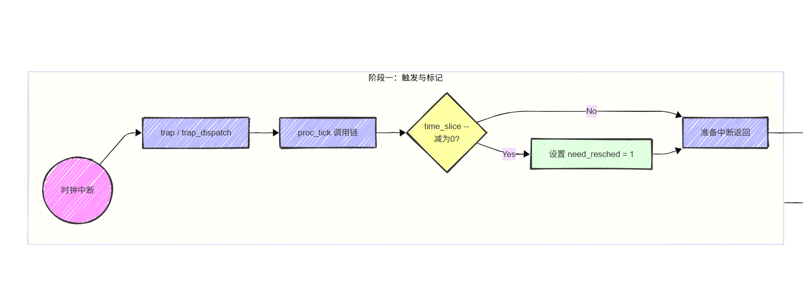
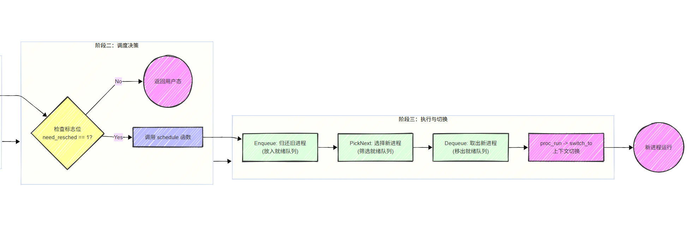
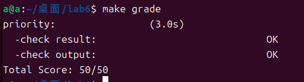

## Lab6

## 前置工作

主要是在 alloc_proc 函数中，增加调度相关的内容：

```
        // 1. 初始化运行队列指针
        // 刚出生的进程还没被放入任何 CPU 的队列，所以是 NULL
        proc->rq = NULL;
        // 2. 初始化运行队列链表节点
        list_init(&(proc->run_link));
        // 3. 初始化时间片
        // 初始为 0，等到它真正被放入队列（enqueue）时，调度器会给它分配具体的时间片
        proc->time_slice = 0;
        // 4. 初始化 Stride 算法相关参数
        // 4.1 斜堆节点：用来在优先队列中排序
        proc->lab6_run_pool.left = proc->lab6_run_pool.right = proc->lab6_run_pool.parent = NULL;        
        // 4.2 Stride 值：表示该进程当前的“进度”或“里程”
        proc->lab6_stride = 0;
        // 4.3 优先级：表示进程的权重       
        proc->lab6_priority = 0;
```

以及在 trap.c 的时钟中断中调用函数 `sched_class_proc_tick(current);` 减少时间片。

## 练习1: 理解调度器框架的实现（不需要编码）

请仔细阅读和分析调度器框架的相关代码，特别是以下两个关键部分的实现：

在完成练习0后，请仔细阅读并分析以下调度器框架的实现：

- 调度类结构体 sched_class 的分析：请详细解释 sched_class 结构体中每个函数指针的作用和调用时机，分析为什么需要将这些函数定义为函数指针，而不是直接实现函数。

  `sched_class` 结构体本质上是对调度算法的抽象接口，它在 C 语言中实现了类似 C++ 多态的特性，在具体的算法中会定义具体的函数。

  ```
  struct sched_class {
      // 调度类的名字
      const char *name;
      // 初始化run queue
      void (*init)(struct run_queue *rq);
      // 把进程放进run queue，这个是run queue的维护函数
      void (*enqueue)(struct run_queue *rq, struct proc_struct *proc);
      // 把进程取出run queue
      void (*dequeue)(struct run_queue *rq, struct proc_struct *proc);
      // 选择下一个要执行的进程
      struct proc_struct *(*pick_next)(struct run_queue *rq);
      // 每次时钟中断调用
      void (*proc_tick)(struct run_queue *rq, struct proc_struct *proc);
  };
  ```

  1.`const char *name`

  - 作用：调度类的名称字符串。
  - 调用时机：在系统启动初始化 (`sched_init`) 时打印调试信息，或者在调试过程中用于识别当前正在使用的调度器。

  2.`void (*init)(struct run_queue *rq)`

  - 作用：初始化。负责初始化运行队列 (`run_queue`) 的内部结构。
  - 调用时机：
    - 系统启动时的 `sched_init()` 函数中。
    - 或者在运行时切换调度算法时。

  3.`void (*enqueue)(struct run_queue *rq, struct proc_struct *proc)`

  - 作用：入队。将一个处于“就绪态”的进程加入到调度器的等待队列中。
  - 调用时机：
    - 进程刚被创建时 (`do_fork` -> `wakeup_proc`)。
    - 进程从“等待/睡眠”状态被唤醒时。
    - 进程时间片用完被抢占，调度器决定把它放回队列等待下一次调度时。

  4.`void (*dequeue)(struct run_queue *rq, struct proc_struct *proc)`

  - 作用：出队。将一个进程从调度器的等待队列中移除。
  - 调用时机：
    - 进程被调度器选中，准备占用 CPU 运行时。
    - 进程进入“等待/睡眠”状态（如等待 I/O、`do_wait`、`do_sleep`）。
    - 进程退出（`do_exit`）时。

  5.`struct proc_struct *(*pick_next)(struct run_queue *rq)`

  - 作用：决策。从运行队列中选择下一个最应该执行的进程。
  - 调用时机：`schedule()` 函数执行时。当 CPU 需要切换进程时，内核会调用这个函数问调度器下一个要执行的进程是谁。

  6.`void (*proc_tick)(struct run_queue *rq, struct proc_struct *proc)`

  - 作用：计时与抢占。响应时钟中断，更新当前进程的时间消耗。
  - 递减当前进程的 `time_slice` 时间片。如果 `time_slice` 减为 0，设置 `proc->need_resched = 1`，触发被动调度。
  - 调用时机：每次硬件时钟中断发生时（由 trap.c 中的`trap_dispatch` -> `sched_class_proc_tick` 调用）。

  为什么使用函数指针？

  可以实现多态，通过 `sched_class`，内核核心代码只需要调用 `enqueue`、`pick_next` 等通用接口，不需要知道背后是 RR 还是 Stride。这使得我们可以在不修改内核核心逻辑的情况下，随意替换调度算法，有更好的可扩展性和灵活性，否则每次添加新算法都要修改内核的通用代码，维护成本极高。

- 运行队列结构体 run_queue 的分析：比较lab5和lab6中 run_queue 结构体的差异，解释为什么lab6的 run_queue 需要支持两种数据结构（链表和斜堆）。

  ```
  struct run_queue
  {
      // 链表头指针
      list_entry_t run_list;
      // 运行队列中的线程数
      unsigned int proc_num;
      // 最大的时间片大小
      int max_time_slice;
      // Stride调度算法中的优先队列 根节点
      // For LAB6 ONLY
      skew_heap_entry_t *lab6_run_pool;
  };
  ```

  新增了 `skew_heap_entry_t \*lab6_run_pool`：

  Stride 算法本质上是一个 按优先级排序的优先队列。调度器每次必须选择 stride 最小的进程，斜堆 `Skew Heap` 是一种自调整的二叉树。如果只用链表实现 Stride 算法，每次 `pick_next` 都需要遍历整个链表来找到 stride 最小的进程，时间复杂度是 $O(N)$。当进程数成千上万时，调度器会变得极慢。使用斜堆（优先队列）将查找时间降低到 $O(1)$，将维护（插入/删除）时间控制在 $O(\log N)$，这是为了满足调度器高频运行的性能要求。

  保留链表，使得 `run_queue` 的基础接口保持向下兼容。

- 调度器框架函数分析：分析 sched_init()、wakeup_proc() 和 schedule() 函数在lab6中的实现变化，理解这些函数如何与具体的调度算法解耦。

  1.`sched_init()`：lab6中首先初始化定时器列表，引入具体的算法，之后进行接口绑定到具体算法，通过 `sched_class->init(rq);` 运行队列的具体初始化工作，委托给具体的算法去完成。

  解耦：内核启动时，`kern_init` 只需要调用 `sched_init`。如果想要切换算法，只需要修改这里的一行指针赋值（例如改为 `&stride_sched_class`），而不需要修改任何其他内核代码。

  2.`wakeup_proc()`：之前仅仅将进程的状态从 `PROC_SLEEPING` 改为 `PROC_RUNNABLE`，在lab6中增加了调用 `sched_class_enqueue(proc)`，当一个进程被唤醒时，内核显式地通知调度器将这个进程放入自己的队列里，具体加入队列的方式由调度器决定。

  3.`schedule()`：之前是获取当前进程在 `proc_list` 中的位置，使用 `do...while` 循环遍历整个 `proc_list`，寻找下一个状态为 `PROC_RUNNABLE` 的进程，硬编码了一个简单的 FIFO策略。

  lab6中：首先判断如果当前进程还在运行，调用 `sched_class_enqueue(current)` 把它放回调度器队列，之后调用 `next = sched_class_pick_next()`，内核询问调度器下一个要执行的进程，调用 `sched_class_dequeue(next)`，将选中的进程从就绪队列中拿走，最后调用 `proc_run(next)` 进行上下文切换。

  `schedule` 函数变成了纯粹的流程控制者，而不是策略制定者。它只负责维持“入队 -> 选进程 -> 出队 -> 切换”这个流水线，而具体的“怎么排队”和“怎么选”完全由 `sched_class` 定义的函数指针决定。

对于调度器框架的使用流程，请在实验报告中完成以下分析：

- 调度类的初始化流程：描述从内核启动到调度器初始化完成的完整流程，分析 default_sched_class 如何与调度器框架关联。

  流程：

  1.内核入口 (`kern_init`)：位于 `kern/init/init.c`，内核会依次初始化各个子系统如物理内存 `pmm_init`、中断 `pic_init` 等。其中，`sched_init()`会在内存初始化之后、进程子系统初始化 `proc_init` 之前被调用，确保在创建第一个进程前，调度器已经准备就绪。

  2.进入`sched_init`，首先初始化定时器`list_init(&timer_list)`，挂载具体的调度算法，之后初始化全局运行队列 `rq`，并设置 `max_time_slice`最大时间片。

  3.`sched_class->init(rq);` 通过指针调用具体算法的初始化函数。

  整体过程：`kern_init()` --> `sched_init()` --> 绑定指针 `(sched_class = &...)` --> `sched_class->init()`

  `default_sched_class` 如何与调度器框架关联？

  `sched.c` 中的全局指针`static struct sched_class *sched_class;`，代表了当前系统正在使用的调度器接口，内核代码只需调用这个指针指向的函数，在`default_sched.c` 中定义了具体的算法实例，在 `sched_init()` 函数中，通过赋值操作`sched_class = &default_sched_class`完成了关联，将实现了 RR 算法的具体结构体地址，赋值给了内核通用的抽象接口指针。

- 进程调度流程：绘制一个完整的进程调度流程图，包括：时钟中断触发、proc_tick 被调用、schedule() 函数执行、调度类各个函数的调用顺序。并解释 need_resched 标志位在调度过程中的作用

  物理时钟触发中断，跳转到内核中断处理入口 `trap()`，调用 `trap_dispatch()`，switch 到 `case IRQ_S_TIMER` 分支->调用 `sched_class_proc_tick(current)`，实际调用的是 `sched_class->proc_tick(rq, current)`，扣除时间片，如果时间片为0则将进程的 `need_resched` 标志位置为 1->`trap()` 函数执行 `if (current->need_resched)`，如果标志位是1，调用`schedule()` 函数->关中断，将标志位置0，将进程进入队列，选出将要运行的进程并出队，最后调用 `proc_run(next)`进行进程的切换。

 

 

  `need_resched` 的作用：它是一个布尔标记（0 或 1），位于 `struct proc_struct` 中。

  1.实现“延迟调度”：时钟中断处理程序运行在极为敏感的内核上下文中，此时栈结构复杂，且通常关闭了中断。如果在 ISR 内部直接进行上下文切换极易导致内核栈崩溃或死锁。 `need_resched` 作为一个信号量，允许中断处理程序仅负责标记决定是否需要调度，而将真正的执行 `schedule`推迟到中断处理即将结束、环境相对安全的时刻进行。

  2.降低调度开销： 并非每次时钟中断都需要切换进程。通过检查 `time_slice > 0`，只有当时间片真正耗尽时才设置该标志位，避免了不必要的 `schedule()` 函数调用，保证了 CPU 的执行效率。

- 调度算法的切换机制：分析如果要添加一个新的调度算法（如stride），需要修改哪些代码？并解释为什么当前的设计使得切换调度算法变得容易。

  1.`kern/schedule/sched_stride.c` 中，算法逻辑：

  `init`: 初始化私有数据结构斜堆。

  `enqueue`: 将进程加入运行队列。

  `dequeue`: 将进程移除运行队列。

  `pick_next`: 选择下一个进程，选 stride 最小者。

  `proc_tick`: 处理时钟中断。

  2.封装调度类，将实现好的函数指针封装到一个 `struct sched_class` 实例中。

  3.在`kern/schedule/sched.c` 的 `sched_init()` 函数中，修改全局指针 `sched_class` 的指向。

  当前设计利用 C 语言的函数指针实现了类似多态的机制，内核核心代码只依赖于抽象的 `sched_class` 接口，而不依赖于具体的算法实现，`struct sched_class` 定义了一套标准的操作规范（`init`, `enqueue`, `pick_next` 等）。任何新的调度算法，只要遵循这套规范，就可以像插件一样直接插入到内核中。切换算法时，我们完全不需要修改中断处理逻辑、进程切换汇编代码或内存管理代码，所有的修改被限制在 `sched_init` 这一行配置代码中。

## 练习2: 实现 Round Robin 调度算法（需要编码）

完成练习0后，建议大家比较一下（可用kdiff3等文件比较软件）个人完成的lab5和练习0完成后的刚修改的lab6之间的区别，分析了解lab6采用RR调度算法后的执行过程。理解调度器框架的工作原理后，请在此框架下实现时间片轮转（Round Robin）调度算法。

注意有“LAB6”的注释，你需要完成 kern/schedule/default_sched.c 文件中的 RR_init、RR_enqueue、RR_dequeue、RR_pick_next 和 RR_proc_tick 函数的实现，使系统能够正确地进行进程调度。代码中所有需要完成的地方都有“LAB6”和“YOUR CODE”的注释，请在提交时特别注意保持注释，将“YOUR CODE”替换为自己的学号，并且将所有标有对应注释的部分填上正确的代码。

提示，请在实现时注意以下细节：

- 链表操作：list_add_before、list_add_after等。
- 宏的使用：le2proc(le, member) 宏等。
- 边界条件处理：空队列的处理、进程时间片耗尽后的处理、空闲进程的处理等。

请在实验报告中完成：

- 比较一个在lab5和lab6都有, 但是实现不同的函数, 说说为什么要做这个改动, 不做这个改动会出什么问题。

  `kern/schedule/sched.c`里的`wakeup_proc`函数。

  lab6中增加了：

  ```
  if (proc != current){
                  sched_class_enqueue(proc);//加入队列 }
  ```

  当一个进程被唤醒时，内核显式地通知调度器将这个进程放入自己的队列里，具体加入队列的方式由调度器决定。如果不改动，进程就不会被挂载到调度器的队列里，就无法完成调度。

- 描述你实现每个函数的具体思路和方法，解释为什么选择特定的链表操作方法。对每个实现函数的关键代码进行解释说明，并解释如何处理**边界情况**。

  `RR_init`：初始化运行队列

  ```
  static void
  RR_init(struct run_queue *rq)
  {
      // LAB6: YOUR CODE
      // 1. 初始化链表头节点run_list (让 prev 和 next 都指向自己)
      list_init(&(rq->run_list));
      // 2. 此时队列里没有进程，数量为 0
      rq->proc_num = 0;
  }
  ```

  `RR_enqueue`：进程入队

  Round Robin 是先进先出（FIFO）策略。当一个进程变为就绪态，或者时间片用完被抢占时，应该把它放到队伍的末尾。

  使用`list_add_before`：ucore 使用的是双向循环链表。头节点`run_list`的前驱 prev 就是链表的尾部。因此，`add_before(head)` 等价于 `append_to_tail`，符合 FIFO 逻辑。

  ```
  static void
  RR_enqueue(struct run_queue *rq, struct proc_struct *proc)
  {
      // LAB6: YOUR CODE
      // 保护性检查：确保这个进程没在别的队列里
      assert(list_empty(&(proc->run_link)));
      // 1. 把进程加到队列的尾部
      // list_add_before 在头节点的前面插入，对于循环链表来说，就是在队尾插入
      list_add_before(&(rq->run_list), &(proc->run_link));
      // 2. 如果进程的时间片用完了（等于0），或者因为某种错误超过了最大值
      // 就把它恢复成最大时间片
      if (proc->time_slice == 0 || proc->time_slice > rq->max_time_slice) {
          proc->time_slice = rq->max_time_slice;
      }
      // 3. 标记这个进程现在属于这个队列
      proc->rq = rq;
      // 4. 队列里的进程数量加一
      rq->proc_num++;
  
  }
  ```

  边界处理：如果进程是因为时间片用完才回来的，或者它是一个刚被创建的新进程，必须给它重新分配时间片`max_time_slice`，否则它一上 CPU 就会立刻被踢下来，导致死循环。

  `RR_dequeue`：进程出队，当调度器决定运行某个进程，或者进程退出/睡眠时，需要将其从运行队列中移除，避免重复调度。

  ```
  static void
  RR_dequeue(struct run_queue *rq, struct proc_struct *proc)
  {
      // LAB6: YOUR CODE
      // 保护性检查：确保这个进程确实在队列里
      assert(!list_empty(&(proc->run_link)) && proc->rq == rq);
      // 1. 从链表中删除这个节点，并将其重置
      list_del_init(&(proc->run_link));
      // 2. 队列里的进程数 -1
      rq->proc_num--;
  
  }
  ```

  `RR_pick_next`：选择下一个进程，RR 策略非常简单：永远选择队列头部的第一个进程。

  ```
  static struct proc_struct *
  RR_pick_next(struct run_queue *rq)
  {
      // LAB6: YOUR CODE
      // 1. 如果队列是空的（没人排队），返回 NULL
      if (rq->proc_num == 0) {
          return NULL;
      }
      // 2. 拿出队列头的那个链表节点
      // run_list 是表头，run_list.next 就是第一个排队的节点
      list_entry_t *le = list_next(&(rq->run_list));
      // 3. 使用 le2proc 宏，通过链表节点找到对应的进程结构体指针，链表里存的是 list_entry_t 结构，我们需要通过指针偏移算出包含它的 struct proc_struct 的起始地址。
      return le2proc(le, run_link);
  
  }
  ```

  边界处理：空队列检查，`if (rq->proc_num == 0)`，如果队列为空，必须判断这种情况并返回 `NULL`，否则会选中哨兵节点（它不是进程），导致系统崩溃。

  `RR_proc_tick`：时钟中断处理，这是实现时间片轮转的核心。每次时钟中断（tick），都要扣除当前进程的剩余时间。

  ```
  static void
  RR_proc_tick(struct run_queue *rq, struct proc_struct *proc)
  {
      // LAB6: YOUR CODE
      // 1. 如果时间片还大于0，就扣掉一点
      if (proc->time_slice > 0) {
          proc->time_slice--;
      }
      // 2. 如果扣完之后变成0了，说明该让出CPU了
      if (proc->time_slice == 0) {
          // 设置 need_resched 标记，下次内核检查时就会把它换下去
          proc->need_resched = 1;
      }
  }
  ```

  边界处理：触发抢占，当 `time_slice` 减为 0 时，才设置 `need_resched = 1`，告诉内核当前进程的时间额度用完了，在中断返回前调用 `schedule` 把它换下去。

- 展示 make grade 的**输出结果**，并描述在 QEMU 中观察到的调度现象。

 

  make qemu：

  ```
  sched class: RR_scheduler
  ++ setup timer interrupts
  kernel_execve: pid = 2, name = "priority".
  set priority to 6
  main: fork ok,now need to wait pids.
  set priority to 1
  set priority to 2
  set priority to 3
  set priority to 4
  set priority to 5
  child pid 3, acc 900000, time 2010
  child pid 4, acc 896000, time 2010
  child pid 5, acc 884000, time 2010
  child pid 6, acc 896000, time 2010
  child pid 7, acc 892000, time 2010
  main: pid 0, acc 900000, time 2010
  main: pid 4, acc 896000, time 2010
  main: pid 5, acc 884000, time 2010
  main: pid 6, acc 896000, time 2010
  main: pid 7, acc 892000, time 2010
  main: wait pids over
  sched result: 1 1 1 1 1
  all user-mode processes have quit.
  init check memory pass.
  kernel panic at kern/process/proc.c:587:
      initproc exit.
  ```

  系统运行了一个叫 `priority` 的测试程序，这个程序创建了 5 个子进程（pid 3 到 7），它尝试给这 5 个子进程设置不同的优先级（从 1 到 5）。因为现在是 RR 调度算法，每个进程的优先级都一样。

  `acc` (Accumulator)：代表每个进程在相同时间内抢到 CPU 执行计算的次数，可以看到这 5 个数字（90万左右）几乎是一模一样的，差别非常小，这证明每个进程获得的时间片是完全均等的。优先级设置完全没有生效，这正是 Round-Robin 算法的预期行为。

  测试脚本计算了这 5 个进程的运行时间比例，结果是 1:1:1:1:1，这意味着调度绝对公平。

- 分析 Round Robin 调度算法的优缺点，讨论如何调整时间片大小来优化系统性能，并解释为什么需要在 RR_proc_tick 中设置 need_resched 标志。

  优点：

  1.公平性：RR 是最公平的算法之一。如果不考虑优先级，每个进程都获得相同的 CPU 时间片；无饥饿，因为时间片是循环分配的，没有任何进程会被无限期推迟，即使有源源不断的新进程加入。

  2.响应性：非常适合交互式系统。用户感知的等待时间取决于（进程数 × 时间片大小）。只要进程数不是极大，用户输入总能在短时间内得到 CPU 响应。

  3.实现简单：逻辑清晰，只需要一个 FIFO 队列和一个硬件定时器即可实现。

  缺点：

  1.上下文切换开销：RR 依赖频繁的抢占。每次切换进程都需要保存当前寄存器、切换页表（CR3）、刷新 TLB 等。

  2.平均周转时间可能较差：如果所有进程的执行时长都差不多，RR 的表现不如 SJF。

  3.对 I/O 密集型进程不友好：可能导致 I/O 利用率低。

  优化：如果时间片过小，可能导致CPU 将花费大量时间在切换进程上，吞吐量大幅下降，系统效率极低。如果时间片过大，大多数进程在时间片用完前就执行完了，RR 算法实际上退化成了 FCFS (先来先服务) 算法，响应时间变差。选择合理的时间片，应该显著大于上下文切换的时间，现代操作系统的标准时间片通常在 10ms 到 100ms 之间，让 80% 的 CPU 突发都能在一次时间片内完成。这样既保证了交互式进程（通常突发短）能迅速完成不被抢占，又保证了长进程能轮流执行。

  `need_resched` 标志：

  在 `kern/schedule/default_sched.c` 的 `RR_proc_tick` 函数中，当 `time_slice` 减为 0 时，并没有直接调用 `schedule()` 进行切换，而是仅仅设置了标志位：

  ```
  if (proc->time_slice == 0) {
      proc->need_resched = 1; 
  }
  ```

  原因 1：中断上下文的安全性。`RR_proc_tick` 是由硬件时钟中断触发的，它运行在 中断上下文中，中断处理程序 ISR 通常要求执行快**、**不可阻塞。如果在中断处理函数内部直接进行复杂的进程调度（涉及大量的堆栈操作、锁的获取与释放），极易导致死锁或内核栈溢出，甚至破坏正在被中断的内核数据结构。

  原因 2：延迟抢占。实现策略与机制分离：`RR_proc_tick` 负责策略 —— 即“判断是否该切换了”，设置 `need_resched = 1` 。真正的机制—— 即 `schedule()`，被推迟到中断处理即将结束、准备返回用户态的时刻，在`trap` 函数末尾。那个时刻环境已经清理干净，进行上下文切换是安全的。

  原因 3：原子性与并发控制。在多核 CPU 中，直接在 Tick 中切换会引发复杂的并发问题。设置标志位是一种轻量级的信号传递方式，避免了在中断上下文中处理复杂的进程同步逻辑。

- **拓展思考**：如果要实现优先级 RR 调度，你的代码需要如何修改？当前的实现是否支持多核调度？如果不支持，需要如何改进？

  目前的 `RR_enqueue` 和 `RR_pick_next` 是简单的 FIFO 逻辑，要支持优先级需要采用多级队列结构。现在的 `run_queue` 只有一条链表，需要把它变成一个链表数组，`RR_init`在初始化时，需要一个循环来初始化数组里所有的链表头。`RR_enqueue`入队时，不再总是塞到同一个队尾，而是根据进程的优先级，塞到对应的队列里。`RR_pick_next`需要从最高优先级的队列开始找，取出该队列的头节点。

  当前的实现不支持多核调度，目前的 `run_queue` 是一个全局变量。在多核环境下，如果 CPU A 正在 `RR_enqueue`修改链表指针，同时 CPU B 正在 `RR_pick_next`读取链表指针，因为没有加锁，链表指针会瞬间错乱，导致内核崩溃。

  改进：给 `run_queue` 加一把自旋锁，任何 CPU 在调用 `enqueue`、`dequeue` 或 `pick_next` 之前，必须先持有这把锁。或者不再使用全局唯一的 `run_queue`，而是定义一个数组，每个 CPU 都有一个运行队列，CPU 0 只从 `run_queues[0]` 取进程，CPU 1 只从 `run_queues[1]` 取进程，并配合负载均衡算法，充分利用多核计算资源。

  ```
  struct run_queue run_queues[NCPU]; // NCPU 是 CPU 核心数
  ```

## 扩展练习 Challenge 1: 实现 Stride Scheduling 调度算法（需要编码）

首先需要换掉RR调度器的实现，在sched_init中切换调度方法。然后根据此文件和后续文档对Stride度器的相关描述，完成Stride调度算法的实现。 注意有“LAB6”的注释，主要是修改default_sched_stride_c中的内容。代码中所有需要完成的地方都有“LAB6”和“YOUR CODE”的注释，请在提交时特别注意保持注释，将“YOUR CODE”替换为自己的学号，并且将所有标有对应注释的部分填上正确的代码。

后面的实验文档部分给出了Stride调度算法的大体描述。这里给出Stride调度算法的一些相关的资料（目前网上中文的资料比较欠缺）。

- [strid-shed paper location](http://citeseerx.ist.psu.edu/viewdoc/summary?doi=10.1.1.138.3502&rank=1)
- 也可GOOGLE “Stride Scheduling” 来查找相关资料

请在实验报告中完成：

- 简要说明如何设计实现”多级反馈队列调度算法“，给出概要设计，鼓励给出详细设计
- 简要证明/说明（不必特别严谨，但应当能够”说服你自己“），为什么Stride算法中，经过足够多的时间片之后，每个进程分配到的时间片数目和优先级成正比。

请在实验报告中简要说明你的设计实现过程。

步长调度算法：

- 为每个进程分配一个 优先级 (Priority)，代表它应获得的 CPU 份额权重。
- 引入 步长 (Pass) 概念，优先级越高，步长越小（$Pass = BigStride / Priority$）。
- 引入 行程 (Stride) 概念，代表进程已经运行了多少“路程”。
- 调度策略：每次总是选择当前 Stride 值最小的进程运行。运行后，将其 Stride 加上它的 Pass。
- 这样，优先级高的进程因为步长小，Stride 增加得慢，所以会被更频繁地选中执行。

合理选择BigStride：`int32_t` 的最大正数是 $2^{31} - 1$， $Pass = BIG\_STRIDE / Priority$，当 $Priority=1$ 时，Pass 达到最大值 $BIG\_STRIDE$。

为了保证任意时刻队列里最大 Stride 和最小 Stride 的差距不“炸”掉导致逻辑判断相反，我们需要 $BIG\_STRIDE < 2^{31}$，选择 $2^{30}$，它是小于 $2^{31}$ 的最大的 2 的幂次方。

关键函数：

- 比较函数 `proc_stride_comp_f`：计算 stride 差值进行斜堆排序。

- `stride_init`：初始化一个新的空队列

  ```
  static void
  stride_init(struct run_queue *rq)
  {
       /* LAB6 CHALLENGE 1: YOUR CODE
        * (1) init the ready process list: rq->run_list
        * (2) init the run pool: rq->lab6_run_pool
        * (3) set number of process: rq->proc_num to 0
        */
      list_init(&(rq->run_list));// 初始化进程链表
      rq->lab6_run_pool = NULL;// 斜堆的根节点初始化为空
      rq->proc_num = 0;
  }
  ```

  `stride_enqueue`：入队，调用`skew_heap_insert`将进程插入斜堆。

  ```
  static void
  stride_enqueue(struct run_queue *rq, struct proc_struct *proc)
  {
       /* LAB6 CHALLENGE 1: YOUR CODE
        * (1) insert the proc into rq correctly
        * NOTICE: you can use skew_heap or list. Important functions
        *         skew_heap_insert: insert a entry into skew_heap
        *         list_add_before: insert  a entry into the last of list
        * (2) recalculate proc->time_slice
        * (3) set proc->rq pointer to rq
        * (4) increase rq->proc_num
        */
      // 把 proc 插到 lab6_run_pool 这个二叉树的合适位置。
      rq->lab6_run_pool = skew_heap_insert(rq->lab6_run_pool, &(proc->lab6_run_pool), proc_stride_comp_f);
      // 如果时间片为 0，或者大于最大时间片，就重置为最大时间片
      if (proc->time_slice == 0 || proc->time_slice > rq->max_time_slice)
      {
          proc->time_slice = rq->max_time_slice;
      }
      // 设置 proc 的运行队列指针，标记这个进程现在属于这个队列
      proc->rq = rq;
      rq->proc_num++;
  }
  ```

  `stride_dequeue`：进程出队，调用 `skew_heap_remove`。

  ```
  static void
  stride_dequeue(struct run_queue *rq, struct proc_struct *proc)
  {
       /* LAB6 CHALLENGE 1: YOUR CODE
        * (1) remove the proc from rq correctly
        * NOTICE: you can use skew_heap or list. Important functions
        *         skew_heap_remove: remove a entry from skew_heap
        *         list_del_init: remove a entry from the  list
        */
        assert(proc->rq == rq && rq->proc_num > 0);
        // 调用 skew_heap_remove 把这个进程从树里摘下来。
       // 函数会返回新的树根
      rq->lab6_run_pool = skew_heap_remove(rq->lab6_run_pool, &(proc->lab6_run_pool), proc_stride_comp_f);
      rq->proc_num--;
  }
  ```

  `stride_pick_next`：挑选stride最小的进程，即根节点，并更新stride。

  ```
  static struct proc_struct *
  stride_pick_next(struct run_queue *rq)
  {
       /* LAB6 CHALLENGE 1: YOUR CODE
        * (1) get a  proc_struct pointer p  with the minimum value of stride
               (1.1) If using skew_heap, we can use le2proc get the p from rq->lab6_run_pol
               (1.2) If using list, we have to search list to find the p with minimum stride value
        * (2) update p;s stride value: p->lab6_stride
        * (3) return p
        */
       if (rq->lab6_run_pool == NULL)
      {
          return NULL;
      }
      // 斜堆的性质：根节点（root）永远是最小的。
       // 直接取 lab6_run_pool 就是 stride 最小的那个进程。
      struct proc_struct *proc = le2proc(rq->lab6_run_pool, lab6_run_pool);
      // Stride 算法核心公式： stride += BIG_STRIDE / priority
       // 优先级越高（分母越大），加的步数越少（pass 越小），下次越容易被选中。
      proc->lab6_stride += BIG_STRIDE / proc->lab6_priority;
      return proc;
  }
  ```

  `stride_proc_tick`：计时器，这部分和 Round-Robin 是一样的。

  ```
  static void
  stride_proc_tick(struct run_queue *rq, struct proc_struct *proc)
  {
       /* LAB6 CHALLENGE 1: YOUR CODE */
        if (proc->time_slice > 0)
      {
          proc->time_slice--;
      }
      if (proc->time_slice == 0)
      {
          proc->need_resched = 1;
      }
  }
  ```

设计实现”多级反馈队列调度算法“

MLFQ 的核心思想是 “根据历史表现预测未来”：

- 如果一个进程频繁放弃 CPU（如等待 I/O），说明它是交互式的，应给予高优先级和短时间片，以保证快速响应。
- 如果一个进程总是用完分配的时间片，说明它是 CPU 密集型的，应逐渐降低其优先级，但给予 更长的时间片，以减少上下文切换开销。

调度规则与参数设置：

- 优先级规则：所有新创建的进程默认进入最高优先级队列，总是从最高优先级队列（Level 0）开始寻找可运行进程。只有 Level 0 为空时，才检查 Level 1，如果低级队列进程运行时，高级队列有新进程加入，立即抢占。
- 同级规则：如果 Priority(A) == Priority(B)，则 A 和 B 进行 Round Robin (RR) 轮转调度。
- 降级规则：当一个进程用完了它在当前层级的时间片后，它的优先级降低一级，移入下一级队列的队尾。
- 保持机制：如果进程在时间片耗尽前主动放弃 CPU，则保持当前优先级不变。
- 时间片递增：优先级越低，分配的时间片越长。

为了支持多级队列，需要对 `run_queue` 和 `proc_struct` 进行扩展，定义固定数量的队列，在运行队列 `run_queue` 中增加 `run_list` 数组，每一层队列是一个双向链表，并修改进程控制块 `proc_struct` ，增加当前进程所在的队列层级。

初始化 `MLFQ_init`：

- 遍历 `run_list` 数组，初始化所有层级的链表头。

入队 `MLFQ_enqueue`：检查进程状态

- 新进程或主动放弃时间片的进程：默认放入最高优先级队列 (Level 0)。
- 时间片用完的进程：如果已到底层，保持在底层，否则降低一级。
- 根据确定好的优先级层级，计算并赋予其对应的动态时间片（层级越低，时间片翻倍），最后将进程插入对应优先级队列的队尾。

选择下一个进程 `MLFQ_pick_next`：

- 从最高级 (Level 0) 开始扫描到最低级。
- 一旦找到非空队列，取队头进程返回。
- 保证只要高优先级队列有任务，低优先级的任务就必须等待

进程出队 `MLFQ_dequeue`：从链表中删除进程。

时钟中断处理 `MLFQ_proc_tick`：减少时间片以及设置 `need_resched` 标志以请求调度，可在此维护一个全局计数器，当达到预设阈值时触发定期提升机制，将系统中所有进程重置回最高优先级队列，以解决饥饿问题

为什么Stride算法中，经过足够多的时间片之后，每个进程分配到的时间片数目和优先级成正比。

1.设定变量

- 设有两个进程 $A$ 和 $B$。
- $P_A, P_B$：分别为两者的优先级Priority。
- $Pass_A, Pass_B$：分别为两者的步长。根据定义，$Pass = BigStride / Priority$。
- $N_A, N_B$：分别为在一段足够长的时间内，进程 $A$ 和 $B$ 被调度的次数，也就是获得的时间片数量。

2.证明过程

Stride 调度算法的核心原则是：每次选择 Stride 最小的进程执行，并增加 Pass。

这意味着，在经过足够长的运行时间后，为了保证两者交替运行，两个进程走过的“总路程”应该大致相等。

即：
$$
TotalStride_A \approx TotalStride_B
$$
展开总路程公式（总路程 = 调度次数 $\times$ 单次步长）：
$$
N_A \times Pass_A \approx N_B \times Pass_B
$$
代入步长公式 $Pass = \frac{BigStride}{Priority}$：
$$
N_A \times \frac{BigStride}{P_A} \approx N_B \times \frac{BigStride}{P_B}
$$
消去两边的常数 $BigStride$：
$$
\frac{N_A}{P_A} \approx \frac{N_B}{P_B}
$$
变换等式：
$$
\frac{N_A}{N_B} \approx \frac{P_A}{P_B}
$$
3.结论

由上式可知，每个进程被调度的次数（$N$）——即分配到的时间片数目，与其优先级（$P$）成正比。

## 扩展练习 Challenge 2 ：在ucore上实现尽可能多的各种基本调度算法(FIFO, SJF,...)，并设计各种测试用例，能够定量地分析出各种调度算法在各种指标上的差异，说明调度算法的适用范围。
