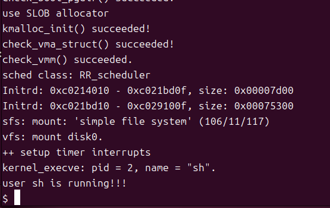
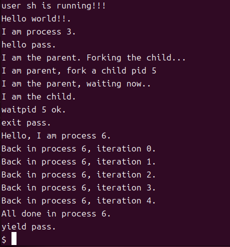

## Lab8

## 练习1: 完成读文件操作的实现（需要编码）

首先了解打开文件的处理流程，然后参考本实验后续的文件读写操作的过程分析，填写在 kern/fs/sfs/sfs_inode.c中 的sfs_io_nolock()函数，实现读文件中数据的代码。

**打开文件的处理流程（open 系统调用）：**

`open` 系统调用的执行流程跨越了三个主要层次：通用文件访问接口层、文件系统抽象层 (VFS) 和 具体文件系统层 (SFS)。

- 通用文件访问接口层

  经过`syscall.c`的处理之后，进入内核态，执行`sysfile_open()`，调用 `copy_path` 将用户空间传递的路径字符串 `__path` 拷贝到内核空间的 `path` 中，随后调用 `file_open` 进入下一层处理。

- 文件系统抽象层 VFS

  `file_open` -> `fd_array_alloc` 在当前进程的打开文件表`fd_array`中分配一个空闲的  `struct file` ，此时 `struct file` 里的 `node` 指针还是 NULL，之后调用 `vfs_open`，试图找到文件对应的 inode-> `vfs_open`调用`vfs_lookup` ，找到 inode后调用 `vop_open` 函数打开文件。而 `vfs_lookup` 首先调用 `get_device`，如果路径包含设备前缀，则找到该设备的根 inode；否则从当前工作目录（cwd）开始，之后调用 `vop_lookup`，这是一个宏，如果当前文件系统是 SFS，它实际上会调用 `sfs_lookup`。

- 文件系统层 SFS

  `sfs_lookup` 调用 `sfs_lookup_once`->`sfs_dirent_search_nolock`，读取目录文件数据块，逐个比对 `sfs_disk_entry`目录项，寻找匹配的文件名，匹配成功，拿到该文件对应的 inode 编号 `ino`，之后通过`sfs_load_inode`在内存中分配一个 `struct inode`并填入信息，最后，`vfs_open` 终于可以带着找到的 `inode` 打开文件，并返回到 `file_open`，执行 `file->node = node;`将 file 和 node 绑定，设置文件状态为打开状态，最终返回文件描述符 fd。

最终，系统调用结束，用户进程拿到了一个整数 fd。自此，用户进程后续就可以通过这个 fd，索引到内核中的 file 结构，进而找到 inode，对文件进行读写操作。

**读文件的处理流程 （read 系统调用）：**

用户进程：`read(fd, data, len);`

- 通用文件访问接口层

  `read->sys_read->sysfile_read(fd, base, len)`

- 文件系统抽象层 VFS

  `sysfile_read` 循环读取文件，计算循环要读多少，取 `len` 和 `IOBUF_SIZE` 的较小值作为`alen`，调用下一层的 `file_read`，将数据从磁盘读入内核的 `buffer`，之后调用调用 `copy_to_user(mm, base, buffer, alen)`，将内核 `buffer` 里的数据拷贝到用户空间的 `base` 地址，重复直到读完所有数据。

  `file_read` 函数：调用 `fd2file(fd, &file)`拿到对应的 `struct file` 结构体，之后初始化`struct iobuf`，调用 `vop_read(file->node, iob)`进行读文件。

- 文件系统层 SFS

  `vop_read`->`sfs_read`->`sfs_io`->`sfs_io_nolock`读文件。

- 设备I/O层

  经过层层调用最后将磁盘数据真正搬运到内存中。

练习1即为`sfs_io_nolock`的实现：

首先计算结束位置 endpos = 开始位置 offset + 要读写的长度 *alenp，并完成边界检查，定义两个函数指针`buf_op`和`block_op`，分别用于读取非对齐的碎片数据和整块数据，并对读写模式挂载具体的函数。

初始化变量，`uint32_t blkno = offset / SFS_BLKSIZE;` 初始化起始的逻辑块号`blkno`，`uint32_t nblks = endpos / SFS_BLKSIZE - blkno;` 计算需要读写的完整块的数量`nblks`。

处理头部：

```
    // 1. 计算我们在当前块内的偏移量 如blkoff = 4000 % 4096 = 4000
    blkoff = offset % SFS_BLKSIZE;
    // 如果 blkoff 是 0，说明刚好对齐，就不用处理头部，直接跳过。
    if (blkoff != 0) {//如果偏移量不是0
        // 2. 计算这一步要读多少字节 size
        // 如果 nblks != 0 ，说明这块读不完请求的数据，要跨块。
        // 所以我们要读完这一块剩余的所有空间：4096 - 4000 = 96 字节。
        // 如果 nblks == 0，没跨块。
        // 直接读 endpos - offset。
        size = (nblks != 0) ? (SFS_BLKSIZE - blkoff) : (endpos - offset);
        // 3. 根据逻辑块号 blkno，找到对应的物理块号 ino
        if ((ret = sfs_bmap_load_nolock(sfs, sin, blkno, &ino)) != 0) {
            goto out;
        }
        // 4. 调用 buf_op 函数读写数据，存入 buf。
        if ((ret = sfs_buf_op(sfs, buf, size, ino, blkoff)) != 0) {
            goto out;
        }
        // 5. 更新进度
        alen += size; 
        buf = (char *)buf + size; 
        // 特殊情况：如果不用跨块，一下就读完了。
        if (nblks == 0) {
            goto out;
        }
        // 6. 头部处理完了，准备进入下一块
        blkno++;  // 逻辑块号
        nblks--;  // 剩余的完整块数减 1

    }
```

处理中间的完整块：

```
    // 只要 nblks > 0，说明还有完整的块需要读取
    while (nblks > 0) {       
        // 1. sfs_bmap_load_nolock根据逻辑块号blkno找到物理块号ino
        if ((ret = sfs_bmap_load_nolock(sfs, sin, blkno, &ino)) != 0) {
            goto out;
        }       
        // 2. 读整块
        if ((ret = sfs_block_op(sfs, buf, ino, 1)) != 0) {
            goto out;
        }
        // 3. 更新
        alen += SFS_BLKSIZE; // +4096
        buf = (uint8_t *)buf + SFS_BLKSIZE; // buffer 指针后移 4096
        blkno++;             // 逻辑块号后移
        nblks--;             // 需要读写的完整块的数量减 1
    }
```

处理尾部：

```
    // 1. 计算还剩多少没读
    size = endpos - (offset + alen);
    // 如果 size > 0，说明还有尾部的块
    if (size > 0) {        
        // 2. sfs_bmap_load_nolock根据逻辑块号blkno找到物理块号ino
        if ((ret = sfs_bmap_load_nolock(sfs, sin, blkno, &ino)) != 0) {
            goto out;
        }        
        // 3. 读最后一段
        // 调用 sfs_buf_op (sfs_rbuf)
        if ((ret = sfs_buf_op(sfs, buf, size, ino, 0)) != 0) {
            goto out;
        }       
        // 4. 收尾
        alen += size; // 加上最后的 size
    }
```

最后更新实际读写的位置， 如果是写操作，并且写到了原文件末尾之后，需要更新文件大小并设置`dirty`为1。

## 练习2: 完成基于文件系统的执行程序机制的实现（需要编码）

改写proc.c中的load_icode函数和其他相关函数，实现基于文件系统的执行程序机制。执行：make qemu。如果能看看到sh用户程序的执行界面，则基本成功了。如果在sh用户界面上可以执行`exit`, `hello`（更多用户程序放在`user`目录下）等其他放置在`sfs`文件系统中的其他执行程序，则可以认为本实验基本成功。

Lab 8 `load_icode` 实现相比 Lab 5 增加了：

1. 从文件系统读取：不再直接 `memcpy` 内存，而是通过文件描述符 `fd` 调用`load_icode_read`读盘。
2. 处理命令行参数：实现了 `argc` 和 `argv` 的压栈操作，这是用户程序能接收参数的关键。

主要内容：

1. 建立内存环境，首先为当前进程创建新的内存管理结构 `mm`，并建立页目录表 `pgdir`，这里和 lab5 相同。
2. 读取ELF文件头，由于程序还在磁盘上，我们必须在内核栈上分配一个 `elf_content` 结构体，并通过`load_icode_read`将文件头从磁盘读入内存。
3. 加载程序段，遍历 ELF 的 Program Header，解析出 TEXT（代码）、DATA（数据）和 BSS 段，并建立内存映射。建立VMA虚拟内存映射。同样使用 `load_icode_read`，循环调用 `pgdir_alloc_page` 申请物理页，之后通过`load_icode_read(fd, page2kva(page) + off, size, offset);`拷贝数据。处理 BSS 段，分成半页和整页处理。
4. 建立用户栈与参数压栈，首先建立栈 VMA，计算参数大小并在栈上布局，确定栈顶位置，之后搬运字符串拷贝到用户栈上。
5. 切换页表并设置中断帧，栈指针指向 argv 数组，传递参数，第一个参数是argc，第二个参数是argv 指针。

这样，可以实现将磁盘上的 ELF 文件解析并加载到内存，同时成功构建了带参数的用户栈环境，使得 ucore 具备了执行带参命令（如 `ls` 等）的能力。

```
static int
load_icode(int fd, int argc, char **kargv)
{
    /* LAB8:EXERCISE2 YOUR CODE  HINT:how to load the file with handler fd  in to process's memory? how to setup argc/argv?
     * MACROs or Functions:
     *  mm_create        - create a mm
     *  setup_pgdir      - setup pgdir in mm
     *  load_icode_read  - read raw data content of program file
     *  mm_map           - build new vma
     *  pgdir_alloc_page - allocate new memory for  TEXT/DATA/BSS/stack parts
     *  lsatp             - update Page Directory Addr Register -- CR3
     */
    //You can Follow the code form LAB5 which you have completed  to complete 
    /* (1) create a new mm for current process
     * (2) create a new PDT, and mm->pgdir= kernel virtual addr of PDT
     * (3) copy TEXT/DATA/BSS parts in binary to memory space of process
     *    (3.1) read raw data content in file and resolve elfhdr
     *    (3.2) read raw data content in file and resolve proghdr based on info in elfhdr
     *    (3.3) call mm_map to build vma related to TEXT/DATA
     *    (3.4) callpgdir_alloc_page to allocate page for TEXT/DATA, read contents in file
     *          and copy them into the new allocated pages
     *    (3.5) callpgdir_alloc_page to allocate pages for BSS, memset zero in these pages
     * (4) call mm_map to setup user stack, and put parameters into user stack
     * (5) setup current process's mm, cr3, reset pgidr (using lsatp MARCO)
     * (6) setup uargc and uargv in user stacks
     * (7) setup trapframe for user environment
     * (8) if up steps failed, you should cleanup the env.
     */
    assert(argc >= 0 && argc <= EXEC_MAX_ARG_NUM);

    if (current->mm != NULL) {
        panic("load_icode: current->mm must be empty.\n");
    }
    int ret = -E_NO_MEM;
    struct mm_struct *mm;
    // (1) create a new mm for current process
    // 为当前进程创建一个新的内存管理结构 mm
    if ((mm = mm_create()) == NULL) {
        goto bad_mm;
    }
    // (2) create a new PDT, and mm->pgdir= kernel virtual addr of PDT
    // 创建页目录表，并将内核页表内容复制过来，确保陷入内核时系统正常工作
    if (setup_pgdir(mm) != 0) {
        goto bad_pgdir_cleanup_mm;
    }
    // (3) 第三步：加载 ELF 文件的代码段、数据段和 BSS 段
    struct Page *page;
    // 准备读取 ELF Header
    // 必须定义一个栈上变量，把文件头读到这里面来分析。
    //ELF头指针
    struct elfhdr elf_content;
    struct elfhdr *elf = &elf_content;
    //程序段头指针
    struct proghdr ph_content;
    struct proghdr *ph = &ph_content;
    // (3.1) 读取 ELF 文件头
    // 参数含义：fd=文件描述符, elf=目的地址, sizeof...=读取长度, 0=文件偏移量
    if ((ret = load_icode_read(fd, elf, sizeof(struct elfhdr), 0)) != 0) {
        goto bad_elf_cleanup_pgdir;
    }
    // 校验魔数：确保读进来的是合法的 ELF 文件，不是乱七八糟的文本
    if (elf->e_magic != ELF_MAGIC) {
        ret = -E_INVAL_ELF;
        goto bad_elf_cleanup_pgdir;
    }
    // (3.2) 根据 ELF 头信息，遍历并加载所有的 Program Header (程序段)
    uint32_t vm_flags, perm;
    // 循环遍历每一个程序头
    for (int i = 0; i < elf->e_phnum; i++) {
        // 计算当前 Program Header 在文件中的偏移位置
        // 公式：ELF头偏移 + 第 i 个头的大小
        off_t ph_off = elf->e_phoff + sizeof(struct proghdr) * i;
        // 从文件中把这个 Program Header 读取到 ph 变量中
        if ((ret = load_icode_read(fd, ph, sizeof(struct proghdr), ph_off)) != 0) {
            goto bad_cleanup_mmap;
        }
        // 我们只关心 LOAD 类型的段（代码段、数据段）。其他如调试信息段跳过。
        if (ph->p_type != ELF_PT_LOAD) {
            continue;
        }
        // 简单检查：文件占用大小不能超过内存占用大小 (memsz >= filesz)
        if (ph->p_filesz > ph->p_memsz) {
            ret = -E_INVAL_ELF;
            goto bad_cleanup_mmap;
        }

        // (3.3) 建立虚拟内存映射 (VMA)
        // 将 ELF 的权限位 (R/W/X) 转换为 ucore 的 VMA 标志位
        vm_flags = 0, perm = PTE_U | PTE_V; // 默认：用户可访问 (U)，有效 (V)
        if (ph->p_flags & ELF_PF_X) vm_flags |= VM_EXEC;  // 可执行
        if (ph->p_flags & ELF_PF_W) vm_flags |= VM_WRITE; // 可写
        if (ph->p_flags & ELF_PF_R) vm_flags |= VM_READ;  // 可读
        // 将 VMA 标志位转换为页表项 (PTE) 的硬件权限位 (RISC-V 架构)
        if (vm_flags & VM_READ) perm |= PTE_R;
        if (vm_flags & VM_WRITE) perm |= (PTE_W | PTE_R);
        if (vm_flags & VM_EXEC) perm |= PTE_X;
        // 调用 mm_map 登记这段虚拟内存：
        // "从 ph->p_va 开始，长度 ph->p_memsz 的区域是合法的，权限是 vm_flags"
        if ((ret = mm_map(mm, ph->p_va, ph->p_memsz, vm_flags, NULL)) != 0) {
            goto bad_cleanup_mmap;
        }

        // (3.4) 核心循环：分配物理内存并从磁盘读取数据
        // offset: 当前段在 ELF 文件中的起始偏移量
        off_t offset = ph->p_offset;
        size_t off, size;
        // start: 当前内存段的虚拟起始地址
        // end:   文件内容结束的虚拟地址 (不包含 BSS 部分)
        // la:    线性地址 (Linear Address)，这里用于记录按页对齐的地址
        uintptr_t start = ph->p_va, end, la = ROUNDDOWN(start, PGSIZE);
        ret = -E_NO_MEM;
        end = ph->p_va + ph->p_filesz; // 数据拷贝的终点
        // 循环：只要还有数据没读完，就一页一页地处理
        while (start < end) {
            // 1. 分配一个物理页
            // pgdir_alloc_page 会查页表，如果页表项不存在就申请物理页并建立映射
            if ((page = pgdir_alloc_page(mm->pgdir, la, perm)) == NULL) {
                ret = -E_NO_MEM;
                goto bad_cleanup_mmap;
            }
            // 2. 计算这一页内需要读写的位置和大小
            // off: 页内偏移。例如 start=0x1020, la=0x1000, 则 off=0x20
            off = start - la;
            // size: 这一页剩下的空间 (4096 - 0x20)
            size = PGSIZE - off;
            // la 指向下一页开头，为下一次循环做准备
            la += PGSIZE;
            // 3. 处理边界：如果剩下的数据填不满这一页
            if (end < la) {
                size -= la - end;
            }
            // 4. 【关键】从磁盘读取数据到内存
            // page2kva(page): 获取该物理页在内核中的虚拟地址 (Kernel Virtual Address)
            // + off: 跳过页内不对齐的部分
            // offset: 文件中的读取位置指针
            if ((ret = load_icode_read(fd, page2kva(page) + off, size, offset)) != 0) {
                goto bad_cleanup_mmap;
            }
            // 5. 更新指针
            start += size;  // 内存指针前进
            offset += size; // 文件指针前进
        }
        // (3.5) 处理 BSS 段 (Block Started by Symbol)
        // BSS 段用于存放未初始化的全局变量，在文件中不占空间，但在内存中需要占位且清零
        end = ph->p_va + ph->p_memsz; // 这里的 end 更新为整个段的结束位置 (包含 BSS)
        // 情况 A：处理“半页” BSS
        // 如果刚才 TEXT/DATA 读完后，start 停在了一页的中间 (start < la)，说明这页剩下部分是 BSS
        if (start < la) {
            if (start == end) { continue; } // 如果 memsz == filesz，说明没 BSS，跳过
            
            // 计算这页剩余需要清零的大小
            off = start + PGSIZE - la;
            size = PGSIZE - off;
            if (end < la) {
                size -= la - end;
            }
            // 内存清零
            memset(page2kva(page) + off, 0, size);
            start += size;
            
            // 断言检查，确保逻辑正确
            assert((end < la && start == end) || (end >= la && start == la));
        }
        // 情况 B：处理“整页” BSS
        // 如果 BSS 很大，跨越了多个完整的页
        while (start < end) {
            // 申请新页
            if ((page = pgdir_alloc_page(mm->pgdir, la, perm)) == NULL) {
                ret = -E_NO_MEM;
                goto bad_cleanup_mmap;
            }
            // 计算大小 (通常是整页 4096)
            off = start - la;
            size = PGSIZE - off;
            la += PGSIZE;
            if (end < la) {
                size -= la - end;
            }
            // 整页清零
            memset(page2kva(page) + off, 0, size);
            start += size;
        }
    }
    // ELF 文件读取完毕，关闭文件描述符
    sysfile_close(fd);
    // 第四步：建立用户栈 (User Stack)
    // (4) 设置用户栈的虚拟内存区域
    vm_flags = VM_READ | VM_WRITE | VM_STACK; // 栈是可读写且具有堆栈属性的
    // 建立栈的 VMA：范围是 [USTACKTOP - USTACKSIZE, USTACKTOP)
    if ((ret = mm_map(mm, USTACKTOP - USTACKSIZE, USTACKSIZE, vm_flags, NULL)) != 0) {
        goto bad_cleanup_mmap;
    }
    // 预分配用户栈的物理内存
    // 这里硬编码预分配 4 个页 (16KB)，防止用户程序一启动就因为缺页中断崩溃（虽然缺页处理可以解决，但预分配更稳妥）
    assert(pgdir_alloc_page(mm->pgdir, USTACKTOP-PGSIZE , PTE_USER) != NULL);
    assert(pgdir_alloc_page(mm->pgdir, USTACKTOP-2*PGSIZE , PTE_USER) != NULL);
    assert(pgdir_alloc_page(mm->pgdir, USTACKTOP-3*PGSIZE , PTE_USER) != NULL);
    assert(pgdir_alloc_page(mm->pgdir, USTACKTOP-4*PGSIZE , PTE_USER) != NULL);
    // 第五步：切换页表
    // (5) 激活新进程的内存空间
    mm_count_inc(mm);              // 增加引用计数
    current->mm = mm;              // 将当前进程的 mm 指针指向新的 mm
    // 记录页目录表的物理地址
    // PADDR 是个宏，把虚拟地址转成物理地址。
    // 这里把页目录表的物理地址存下来，为了方便后续上下文切换。
    current->pgdir = PADDR(mm->pgdir);
    lsatp(PADDR(mm->pgdir));// 切换CPU新页表
    // 第六步：处理命令行参数 (argc, argv) 并压栈
    // (6) 计算参数长度并在栈上布局
    uint32_t argv_size = 0;
    int i;
    // 1. 计算所有参数字符串的总长度
    for (i = 0; i < argc; i++) {
        argv_size += strnlen(kargv[i], EXEC_MAX_ARG_LEN + 1) + 1; // +1 是为了结束符 '\0'
    }
    // 2. 计算栈顶位置
    // USTACKTOP 是栈底（最高地址），减去字符串总长度，再减去一些填充字节以保证对齐
    uintptr_t stacktop = USTACKTOP - (argv_size);
    stacktop = stacktop - (stacktop % sizeof(long)); // 确保按字长对齐
    // 3. 计算 argv 指针数组的位置
    // 数组里有 argc 个指针，加上最后一个 NULL 指针
    char **uargv = (char **)(stacktop - (argc + 1) * sizeof(char *));
    argv_size = 0;
    // 4. 开始真正地搬运数据
    for (i = 0; i < argc; i++) {
        // uargv[i] 存放的是字符串在栈上的地址
        uargv[i] = (char *)(stacktop + argv_size);
        
        // 将内核空间的字符串 kargv[i] 拷贝到用户栈上
        // 因为我们刚才已经切换了页表，现在的 stacktop 虚拟地址是有效的
        strcpy(uargv[i], kargv[i]);
        
        // 计算下一个字符串的存储位置
        argv_size += strnlen(kargv[i], EXEC_MAX_ARG_LEN + 1) + 1;
    }
    // 按照 C 语言标准，argv 数组最后一个元素必须是 NULL
    uargv[argc] = NULL;
    // 第七步：设置中断帧 (Trapframe)
    // (7) 构造中断帧，以便通过 sret 指令返回用户态时，CPU 处于正确的状态
    struct trapframe *tf = current->tf;
    // 保存旧的 sstatus 寄存器值 (主要是为了保留一些系统状态)
    uintptr_t sstatus = tf->status;
    // 清空整个 trapframe，防止残留的寄存器值影响新程序
    memset(tf, 0, sizeof(struct trapframe));
    /* 设置返回用户态后的状态 */
    // 1. 设置栈指针 (SP)
    // SP 必须指向我们刚才构造的 uargv 数组的起始位置
    // 当用户程序 main 函数运行时，它会认为这就是栈顶
    tf->gpr.sp = (uintptr_t)uargv;
    // 2. 设置程序计数器 (EPC)
    // ELF 头里记录了程序的入口地址 (_start)。中断返回后，CPU 跳转到这里执行。
    tf->epc = elf->e_entry;
    // 3. 设置状态寄存器 (SSTATUS)
    // SSTATUS_SPP = 0: 表示之前的特权级是 User Mode (这样 sret 才会切回用户态)
    // SSTATUS_SPIE = 1: 表示中断是开启的 (否则用户程序运行期间无法响应中断)
    tf->status = (sstatus & ~SSTATUS_SPP) | SSTATUS_SPIE;
    // 4. 传递参数 (RISC-V 调用约定)
    // a0 寄存器存放 argc
    // a1 寄存器存放 argv (即 uargv 数组的首地址)
    tf->gpr.a0 = argc;
    tf->gpr.a1 = (uintptr_t)uargv;

    ret = 0;

    out:
    return ret;
    
    // 错误处理部分
    bad_cleanup_mmap:
      exit_mmap(mm);
    bad_elf_cleanup_pgdir:
      put_pgdir(mm);
    bad_pgdir_cleanup_mm:
      mm_destroy(mm);
    bad_mm:
      goto out;  
}
```

make qemu:

 

在终端里执行：

 

## 扩展练习 Challenge1：完成基于“UNIX的PIPE机制”的设计方案

如果要在ucore里加入UNIX的管道（Pipe）机制，至少需要定义哪些数据结构和接口？（接口给出语义即可，不必具体实现。数据结构的设计应当给出一个（或多个）具体的C语言struct定义。在网络上查找相关的Linux资料和实现，请在实验报告中给出设计实现”UNIX的PIPE机制“的概要设方案，你的设计应当体现出对可能出现的同步互斥问题的处理。）

管道是内核管理的一种特殊缓冲区，用于实现进程间的通信。管道的一端连接发送进程的输出，另一端连接接收进程的输入。
  
在uCore系统中，每个进程的用户态地址空间相互独立，进程在用户态无法直接访问彼此的地址空间。由于内核是所有进程共享的，因此进程间通信必须通过内核作为中介来实现。管道正是基于这一原理设计的通信机制。

假设进程A需要向进程B传输信息，管道作为内核管理的缓冲区，一端连接进程A的输出，另一端连接进程B的输入。进程A将信息写入管道，进程B从管道读取信息。

当管道缓冲区为空时，进程B的读取操作会进入等待状态，直到进程A向管道写入数据。当管道缓冲区已满时，进程A的写入操作会进入等待状态，直到进程B从管道读取数据释放空间。当两个相关进程都结束时，管道自动销毁。

当两个个进程同时向同一个缓冲区写入数据，会导致数据覆盖问题。一个进程写入的数据可能被另一个进程写入的数据覆盖，造成通信错误。

因此，同一时间只允许一个进程对管道进行写入操作，也只允许一个进程对管道进行读取操作。这种限制确保了数据的一致性和完整性。

为确保数据安全，管道实现以下同步互斥机制：

读写操作互斥：同一时间只允许一个进程进行读操作或写操作，防止数据竞争。

缓冲区状态同步：当缓冲区空时，读取进程等待；当缓冲区满时，写入进程等待。

进程唤醒机制：当写入进程向空缓冲区写入数据时，唤醒等待的读取进程；当读取进程从满缓冲区读取数据时，唤醒等待的写入进程。

/* 管道缓冲区结构 */
struct pipe_buffer {
    
    struct page *page     //缓冲区所在页
    
    unsigned int offset;    // 缓冲区偏移量
    
    unsigned int flags;                   // 标志位
    
    unsigned int len         //缓冲区长度
    
    bool is_full;           // 缓冲区是否满
    
    bool is_empty;          // 缓冲区是否空
};

管道结构体

struct pipe_inode_info {
     unsigned int readers;  // 读端计数
     
    unsigned int writers;  // 写端计数
    
    unsigned int buffernr   //缓冲区数量
    
    unsigned int buffercur   //缓冲区数组
    
    wait_queue_t wait   //等待队列
    
    unsigned int waitwriter  //等待写的数量s    list_entry_t pipe_inode_link;   //管道链表
    
    struct inode *inode_pipe:     //管道对应inode
    };

相关接口

int creat_pipe(unsigned int pipfd[2]);//创建管道函数

int pipe_read(int fd,void *buf,unsigned int count);//管道读操作接口

 int pipe_write(int fd, void *buf, unsigned int count);//管道写操作接口
 
##扩展练习 Challenge2：完成基于“UNIX的软连接和硬连接机制”的设计方案

如果要在ucore里加入UNIX的软连接和硬连接机制，至少需要定义哪些数据结构和接口？（接口给出语义即可，不必具体实现。数据结构的设计应当给出一个（或多个）具体的C语言struct定义。在网络上查找相关的Linux资料和实现，请在实验报告中给出设计实现”UNIX的软连接和硬连接机制“的概要设方案，你的设计应当体现出对可能出现的同步互斥问题的处理。）


